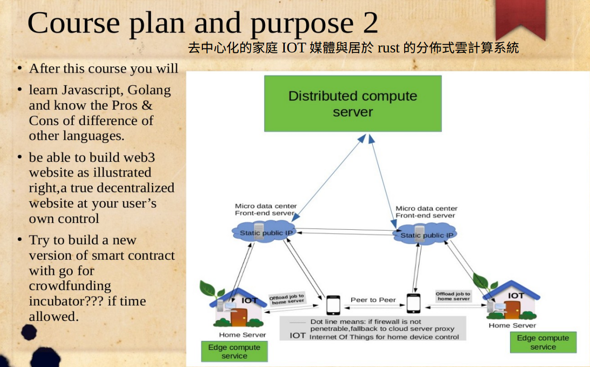
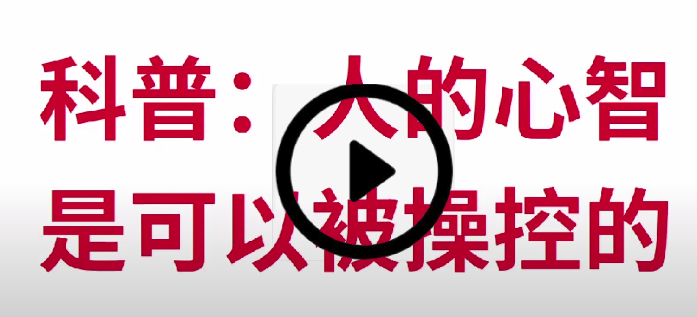

- ##  **_推薦博客目錄_** &nbsp; *****   

  * [無眠月照無情門 . 失去自由的歌手](./md_and_html/無眠月照無情門.md)[在線閱覽]&nbsp; &nbsp; &nbsp; &nbsp; &nbsp; [本地閱覽] [*_html網頁格式_*](./md_and_html/無眠月照無情門.html)&nbsp; &nbsp; [*_pdf格式_*](./md_and_html/無眠月照無情門.md.pdf)
  * [心學新解](./md_and_html/心學新解.md)[在線閱覽] &nbsp; &nbsp; &nbsp; &nbsp; &nbsp; &nbsp; &nbsp; &nbsp; &nbsp; &nbsp; &nbsp; &nbsp; &nbsp; &nbsp; &nbsp; &nbsp; &nbsp; &nbsp; &nbsp; &nbsp; &nbsp; &nbsp; &nbsp; &nbsp;  &nbsp;&nbsp; &nbsp; &nbsp; &nbsp; &nbsp;  [本地閱覽] [*_html網頁格式_*](./md_and_html/心學新解.html)&nbsp; &nbsp; [*_pdf格式_*](./md_and_html/心學新解.md.pdf)

#
          世間無難事只怕有心人！相信所相信，自信所自信！本份！時間就是答案！   
          心，也許會迷失一陣，或許也有殤，但流淚不是懦弱，更不會且不能放棄!
# 

- ###   *_使用方法介紹_*    

    **_【提示】_** 在github或支持markdown的網站上閱讀，請點擊左邊第一個目錄跳轉鏈接，即[在線閱讀]模式，如果已經下載到了本地，請使用瀏覽器html和pdf版本，（請下載支持目錄跳轉的pdf閱讀軟件，但其實瀏覽器（比如google chrome）也支持pdf模式，而且還支持自動跳轉。相信你也會想用這種方式來管理自己本地雜亂無章的文檔，待你回望人生來時路時，不會踏雪無痕，或腳步燐亂以致要找的記憶無處可尋。如果你還在用word文檔，就有點像是現代人不會用電腦一樣，過時咯。   

    **_各位要在本地管理自己的博客文章或日記，可以參考這種模式_**，只要寫md（markdown）文件(隨便找個支持md的編輯器就能一邊寫，一邊生成預覽)，就能生成html文件，進而又由html生成pdf文件。最關鍵是文件檢索很方便。這樣寫文章比用word文檔輕便多了，即方便本地瀏覽保存，又適合網上發表。*_更重要的是，在學以致用的如沐春風里，在催眠不覺曉中被忽悠進了仇深似海的程序猿門，來吧，歡迎諸位學富五車汗牛充棟、拿起鍵盤能當劍客、拿起筆專門忽悠妹子上牀的你們來加入程序猿的隊列吧（玩笑） :) 。現代的文人不會編程，當不了竹林七賢，但很可能會是家裏妻嫌：還不多去幾個平臺發文當長工，老娘化妝品買不起啦！ 來吧，小生教你從寫靜態網站開始，一步一步跳入猿門深海。然後認真經營推廣自己的網站！很認真地說：是真的！word文檔其實就是簡單的靜態html+CSS網頁。除了設計網站，小生也將努力分享linux嵌入式編程、FPGA編程等知識，當然還有一些算法及其硬件加速的知識（這個是我的長項），真不難，只要方法對頭，再加功夫深，什麼都能磨成繡花針！ :)。知識源自社區，也回饋社區，希望這些文章能幫助到各位。_*

    具體教程點擊此鏈接： [ *_如何取代word文檔管理海量文件_* ](./md_and_html/如何取代word文檔管理海量文件/如何取代word文檔管理海量文件.md)[在線閱覽] &nbsp;  &nbsp;&nbsp; &nbsp; &nbsp; &nbsp; &nbsp;     下載至本地閱覽 [*_點擊此查看html網頁格式_*](./md_and_html/如何取代word文檔管理海量文件/如何取代word文檔管理海量文件.html)&nbsp; &nbsp; [*_pdf格式_*](./md_and_html/如何取代word文檔管理海量文件/如何取代word文檔管理海量文件.md.pdf)

#

-   
 博客目錄 
 
  -  [**_點擊此跳轉至目錄頁面（雜文隨筆，創業項目FPGA源碼、編程技術教程，客家話學習等等）_**](./tableOfContent.md)<--[github在線閱讀只能用markdown版本] &nbsp; &nbsp; &nbsp; &nbsp; &nbsp; &nbsp; &nbsp; &nbsp; &nbsp; &nbsp; &nbsp; &nbsp; &nbsp; &nbsp; &nbsp; &nbsp; &nbsp; &nbsp;[下載至本地閱覽推薦網頁和pdf版本]--> [**_點擊此查看html網頁格式_**](./tableOfContent.html)&nbsp; &nbsp; [**_pdf格式_**](./tableOfContent.md.pdf)

 
 

--- 

- # 
 部分博客目錄預覽 
 

  * # 文章分類
      - [一切因緣她(心學)](#一切因緣她)
      - [無眠月照無情門 . 失去自由的歌手](#無眠月照無情門)
      - [天方夜譚之國策論](#天方夜譚之國策論)
      - [創業知識與技術分享](#創業知識與技術分享)
      - [附庸風雅](#附庸風雅)
      - [雜文隨筆](#雜文隨筆)
      - [技術博客文章目錄](#技術博客文章目錄)
      - [客家話學習](#客家話學習)
      - [如何忽悠文科生編程](#如何忽悠文科生編程)
  ***
    #### 
 
  
  * # 文章目錄
      #### 
 

      - #### 一切因緣她（心學）   
          - [心學新解](./md_and_html/心學新解.md) &nbsp;&nbsp; &nbsp; &nbsp; &nbsp; &nbsp; &nbsp; &nbsp; &nbsp; &nbsp; &nbsp; &nbsp; &nbsp; &nbsp; &nbsp; &nbsp; &nbsp; &nbsp; &nbsp; &nbsp; &nbsp; &nbsp; &nbsp; &nbsp; &nbsp;  &nbsp; &nbsp; &nbsp; &nbsp; &nbsp; &nbsp;  &nbsp;&nbsp; &nbsp; &nbsp; &nbsp; &nbsp;  &nbsp;&nbsp; &nbsp; &nbsp; &nbsp; &nbsp;  &nbsp;&nbsp;&nbsp; &nbsp;&nbsp; &nbsp;   [*_點擊此查看html網頁格式_*](./md_and_html/心學新解.html)&nbsp; &nbsp; [*_pdf格式_*](./md_and_html/心學新解.md.pdf)

      #### 
 

      * #### 無眠月照無情門 . 失去自由的歌手   
          - [無眠月照無情門 . 失去自由的歌手](./md_and_html/無眠月照無情門.md) &nbsp;&nbsp;&nbsp;&nbsp;&nbsp;&nbsp;&nbsp;&nbsp;    [*_點擊此查看html網頁格式_*](./md_and_html/無眠月照無情門.html)&nbsp; &nbsp; [*_pdf格式_*](./md_and_html/無眠月照無情門.md.pdf)

          #### 
 

      * #### 天方夜譚之書生國策論   
            修身心。齊家。平天下。

          *_金融戰爭是沒有硝煙的鴉片戰爭，對抗世界廁紙的辦法就是讓自己的貨幣不當長度可變的老二，而是成爲不變的價值尺度。最公平的國際貿易是物物互換，而 **_數字身份貨幣_** 是一種趨近於理想物物互換的貨幣，實現兩國之間貨幣互換，而無須要第三方所謂的自定義的權威貨幣來做媒介！_*

          - [數字身份貨幣——永不超發的國際信譽](./md_and_html/書生論國事/數字身份貨幣——永不超發的國際信譽.md) &nbsp;&nbsp; &nbsp; &nbsp; &nbsp; &nbsp; &nbsp; &nbsp; &nbsp; &nbsp; &nbsp; &nbsp; &nbsp; &nbsp; &nbsp; &nbsp; &nbsp; &nbsp; &nbsp; &nbsp; &nbsp; &nbsp; &nbsp;         [*_點擊此查看html網頁格式_*](./md_and_html/書生論國事/數字身份貨幣——永不超發的國際信譽.html)&nbsp; &nbsp; [*_pdf格式_*](./md_and_html/書生論國事/數字身份貨幣——永不超發的國際信譽.md.pdf)  

          *_社羣模式是最堅固的社會堆積木模式，數字身份社團貨幣可以讓如今的死水慢慢回歸到農耕時代那種穩定的族羣社羣文化，離開狼羣的狼，即使穿上了西裝，佯稱現代人，其實只是一種砧板上的肉_*

          - [數字身份社團貨幣](./md_and_html/書生論國事/數字身份社團貨幣.md) &nbsp;&nbsp; &nbsp; &nbsp; &nbsp; &nbsp; &nbsp; &nbsp; &nbsp; &nbsp; &nbsp; &nbsp; &nbsp; &nbsp; &nbsp; &nbsp; &nbsp; &nbsp; &nbsp; &nbsp; &nbsp; &nbsp; &nbsp; &nbsp; &nbsp;  &nbsp; &nbsp; &nbsp; &nbsp; &nbsp; &nbsp;  &nbsp;&nbsp; &nbsp; &nbsp; &nbsp; &nbsp;  &nbsp;&nbsp; &nbsp;    [*_點擊此查看html網頁格式_*](./md_and_html/書生論國事/數字身份社團貨幣.html)&nbsp; &nbsp; [*_pdf格式_*](./md_and_html/書生論國事/數字身份社團貨幣.md.pdf)

          *_被金融暗中壟斷的媒體，產出的只是屎和屁的垃圾信息，看似可以吵吵鬧鬧，實則是無關痛癢，欲擒故縱，世界言論的自由一直在溫水煮青蛙一樣慢慢收緊，直到最後難以翻身！只有真正的媒體自由才能回歸到百家爭鳴的輝煌文化！其中去中心化是關鍵之關鍵！_*

          - [去中心化家庭IOT自媒體平臺](./md_and_html/書生論國事/去中心化家庭IOT自媒體平臺.md) &nbsp;&nbsp; &nbsp; &nbsp; &nbsp; &nbsp; &nbsp; &nbsp; &nbsp; &nbsp; &nbsp; &nbsp; &nbsp; &nbsp; &nbsp; &nbsp; &nbsp; &nbsp; &nbsp; &nbsp; &nbsp; &nbsp; &nbsp; &nbsp; &nbsp;  &nbsp; &nbsp; &nbsp; &nbsp; &nbsp; &nbsp;     [*_點擊此查看html網頁格式_*](./md_and_html/書生論國事/去中心化家庭IOT自媒體平臺.html)&nbsp; &nbsp; [*_pdf格式_*](./md_and_html/書生論國事/去中心化家庭IOT自媒體平臺.md.pdf)

          - [音樂與舞臺仿真](./md_and_html/技術教程/深度學習/音樂與舞臺仿真.md)&nbsp;&nbsp; &nbsp; &nbsp; &nbsp; &nbsp; &nbsp; &nbsp; &nbsp; &nbsp; &nbsp; &nbsp; &nbsp; &nbsp; &nbsp; &nbsp; &nbsp; &nbsp; &nbsp; &nbsp; &nbsp; &nbsp; &nbsp; &nbsp; &nbsp;  &nbsp; &nbsp; &nbsp; &nbsp; &nbsp; &nbsp; &nbsp; &nbsp; &nbsp; &nbsp; &nbsp; &nbsp; &nbsp; &nbsp; &nbsp;&nbsp;    [*_點擊此查看html網頁格式_*](./md_and_html/技術教程/深度學習/音樂與舞臺仿真.html)&nbsp; &nbsp; [*_pdf格式_*](./md_and_html/技術教程/深度學習/音樂與舞臺仿真.md.pdf)

          - [VR家庭影院——變革電腦看電影之體驗](./md_and_html/書生論國事/VR家庭影院——變革電腦看電影之體驗.md)&nbsp;&nbsp; &nbsp; &nbsp; &nbsp; &nbsp; &nbsp; &nbsp; &nbsp; &nbsp; &nbsp; &nbsp; &nbsp; &nbsp; &nbsp; &nbsp; &nbsp; &nbsp; &nbsp; &nbsp;  [*_點擊此查看html網頁格式_*](./md_and_html/書生論國事/VR家庭影院——變革電腦看電影之體驗.html)&nbsp; &nbsp; [*_pdf格式_*](./md_and_html/書生論國事/VR家庭影院——變革電腦看電影之體驗.md.pdf)

          *真正的 ****_web3.0_**** ,如何用家庭IOT做分佈式雲存儲和雲計算的終端，用閒置的電腦鑽錢_*

          - [a real web3.0 and IPFS](./md_and_html/web3.0/real_web3.0_and_IPFS.md)&nbsp;&nbsp; &nbsp; &nbsp; &nbsp; &nbsp; &nbsp; &nbsp; &nbsp; &nbsp; &nbsp; &nbsp; &nbsp; &nbsp; &nbsp; &nbsp; &nbsp; &nbsp; &nbsp; &nbsp; &nbsp; &nbsp; &nbsp; &nbsp; &nbsp; &nbsp; &nbsp; &nbsp; &nbsp; &nbsp; [*_點擊此查看html網頁格式_*](./md_and_html/web3.0/real_web3.0_and_IPFS.html)&nbsp; &nbsp; [*_pdf格式_*](./md_and_html/web3.0/real_web3.0_and_IPFS.md.pdf)

          ****_把國家的建設建立在別人的金融和芯片之上等同於把自己的睾丸送進別人的手裏。_*** 美蘇太空競賽是個坑，芯片走火入魔也是玩物喪志的坑，科技夠用即可，速度不行，可以用面積做並行來補，時鐘慢點，功率還低，護國神山不是芯片，而是核彈，一個國家如果學烏克蘭自廢武功，將自身的國防建立在別人的正義憐憫和援救之上，是最大的失敗！一個世界糧倉居然成了廢區！沙子不玩不會死人，菜喫的不好，那身體就遭殃，沒有飯喫，遇到鬼天災還會餓死人。把金融的國門看好，把家門看好，多喫好菜，別把好東西賤賣給別人，自己卻和豬一樣喫米糠拌地溝油。喫自己種的菜，讓別人喫芯片，多好！少玩點手機，還能少培養出一些廢青。大好山河，好山好水，更有獨一無二的燦爛文化_*

          - [關起門多讀書多種菜少玩沙子少跳金融坑少炒房子](./md_and_html/技術教程/深度學習/關起門多讀書多種菜少玩沙子少跳金融坑少炒房子.md)&nbsp;&nbsp; &nbsp; &nbsp; &nbsp; &nbsp; &nbsp; &nbsp; &nbsp; &nbsp; &nbsp; &nbsp; &nbsp;     [*_點擊此查看html網頁格式_*](./md_and_html/技術教程/深度學習/關起門多讀書多種菜少玩沙子少跳金融坑少炒房子.html)&nbsp; &nbsp; [*_pdf格式_*](./md_and_html/技術教程/深度學習/關起門多讀書多種菜少玩沙子少跳金融坑少炒房子.md.pdf)

          - [心學新解](./md_and_html/心學新解.md) &nbsp;&nbsp; &nbsp; &nbsp; &nbsp; &nbsp; &nbsp; &nbsp; &nbsp; &nbsp; &nbsp; &nbsp; &nbsp; &nbsp; &nbsp; &nbsp; &nbsp; &nbsp; &nbsp; &nbsp; &nbsp; &nbsp; &nbsp; &nbsp; &nbsp;  &nbsp; &nbsp; &nbsp; &nbsp; &nbsp; &nbsp;  &nbsp;&nbsp; &nbsp; &nbsp; &nbsp; &nbsp;  &nbsp;&nbsp; &nbsp; &nbsp; &nbsp; &nbsp;    [*_點擊此查看html網頁格式_*](./md_and_html/心學新解.html)&nbsp; &nbsp; [*_pdf格式_*](./md_and_html/心學新解.md.pdf)

          - [文化與科技](./md_and_html/書生論國事/文化與科技.md) &nbsp;&nbsp; &nbsp; &nbsp; &nbsp; &nbsp; &nbsp; &nbsp; &nbsp; &nbsp; &nbsp; &nbsp; &nbsp; &nbsp; &nbsp; &nbsp; &nbsp; &nbsp; &nbsp; &nbsp; &nbsp; &nbsp; &nbsp; &nbsp; &nbsp;  &nbsp; &nbsp; &nbsp; &nbsp; &nbsp; &nbsp; &nbsp; &nbsp; &nbsp; &nbsp; &nbsp; &nbsp; &nbsp;    [*_點擊此查看html網頁格式_*](./md_and_html/書生論國事/文化與科技.html)&nbsp; &nbsp; [*_pdf格式_*](./md_and_html/書生論國事/文化與科技.md.pdf)  

          - [知識易學心性難磨](./md_and_html/書生論國事/知識易學心性難磨.md) &nbsp;&nbsp; &nbsp; &nbsp; &nbsp; &nbsp; &nbsp; &nbsp; &nbsp; &nbsp; &nbsp; &nbsp; &nbsp; &nbsp; &nbsp; &nbsp; &nbsp; &nbsp; &nbsp; &nbsp; &nbsp; &nbsp; &nbsp; &nbsp; &nbsp;  &nbsp; &nbsp; &nbsp; &nbsp; &nbsp; &nbsp; &nbsp; &nbsp; &nbsp; &nbsp; &nbsp; &nbsp; &nbsp;    [*_點擊此查看html網頁格式_*](./md_and_html/書生論國事/知識易學心性難磨.html)&nbsp; &nbsp; [*_pdf格式_*](./md_and_html/書生論國事/知識易學心性難磨.md.pdf) 

          - [關於語言文字](./md_and_html/書生論國事/關於語言文字.md) &nbsp;&nbsp; &nbsp; &nbsp; &nbsp; &nbsp; &nbsp; &nbsp; &nbsp; &nbsp; &nbsp; &nbsp; &nbsp; &nbsp; &nbsp; &nbsp; &nbsp; &nbsp; &nbsp; &nbsp; &nbsp; &nbsp; &nbsp; &nbsp; &nbsp;  &nbsp; &nbsp; &nbsp; &nbsp; &nbsp; &nbsp; &nbsp; &nbsp; &nbsp; &nbsp; &nbsp; &nbsp; &nbsp;    [*_點擊此查看html網頁格式_*](./md_and_html/書生論國事/關於語言文字.html)&nbsp; &nbsp; [*_pdf格式_*](./md_and_html/書生論國事/關於語言文字.md.pdf) 

          - [一個孔夫子勝三個宗教](./md_and_html/書生論國事/一個孔夫子勝三個宗教.md) &nbsp;&nbsp; &nbsp; &nbsp; &nbsp; &nbsp; &nbsp; &nbsp; &nbsp; &nbsp; &nbsp; &nbsp; &nbsp; &nbsp; &nbsp; &nbsp; &nbsp; &nbsp; &nbsp; &nbsp; &nbsp; &nbsp; &nbsp; &nbsp; &nbsp;  &nbsp; &nbsp; &nbsp; &nbsp; &nbsp; &nbsp; &nbsp; &nbsp; &nbsp; &nbsp; &nbsp; &nbsp; &nbsp;    [*_點擊此查看html網頁格式_*](./md_and_html/書生論國事/一個孔夫子勝三個宗教.html)&nbsp; &nbsp; [*_pdf格式_*](./md_and_html/書生論國事/一個孔夫子勝三個宗教.md.pdf) 

          - [沒落的茶文化](./md_and_html/書生論國事/沒落的茶文化.md) &nbsp;&nbsp; &nbsp; &nbsp; &nbsp; &nbsp; &nbsp; &nbsp; &nbsp; &nbsp; &nbsp; &nbsp; &nbsp; &nbsp; &nbsp; &nbsp; &nbsp; &nbsp; &nbsp; &nbsp; &nbsp; &nbsp; &nbsp; &nbsp; &nbsp;  &nbsp; &nbsp; &nbsp; &nbsp; &nbsp; &nbsp; &nbsp; &nbsp; &nbsp; &nbsp; &nbsp; &nbsp; &nbsp;    [*_點擊此查看html網頁格式_*](./md_and_html/書生論國事/沒落的茶文化.html)&nbsp; &nbsp; [*_pdf格式_*](./md_and_html/書生論國事/沒落的茶文化.md.pdf) 

          - [新型智能合約與創業孵化器——草根與歌手衆籌互助發展之路](./md_and_html/書生論國事/新型智能合約與創業孵化器——草根與歌手衆籌互助發展之路.md) &nbsp;&nbsp; &nbsp; &nbsp; &nbsp;      [*_點擊此查看html網頁格式_*](./md_and_html/書生論國事/新型智能合約與創業孵化器——草根與歌手衆籌互助發展之路.html)&nbsp; &nbsp; [*_pdf格式_*](./md_and_html/書生論國事/新型智能合約與創業孵化器——草根與歌手衆籌互助發展之路.md.pdf) 

          - [電池驛站——解決電車充電難題](./md_and_html/書生論國事/電池驛站——解決電車充電難題.md) &nbsp;&nbsp; &nbsp; &nbsp; &nbsp; &nbsp; &nbsp; &nbsp; &nbsp; &nbsp; &nbsp; &nbsp; &nbsp; &nbsp; &nbsp; &nbsp; &nbsp; &nbsp; &nbsp; &nbsp; &nbsp; &nbsp; &nbsp; &nbsp; &nbsp;  &nbsp; &nbsp; &nbsp; &nbsp; &nbsp; &nbsp; &nbsp; &nbsp; &nbsp; &nbsp; &nbsp; &nbsp; &nbsp;    [*_點擊此查看html網頁格式_*](./md_and_html/書生論國事/電池驛站——解決電車充電難題.html)&nbsp; &nbsp; [*_pdf格式_*](./md_and_html/書生論國事/電池驛站——解決電車充電難題.md.pdf) 

          - [模塊化汽車電池管理系統](./md_and_html/書生論國事/模塊化汽車電池管理系統.md) &nbsp;&nbsp; &nbsp; &nbsp; &nbsp; &nbsp; &nbsp; &nbsp; &nbsp; &nbsp; &nbsp; &nbsp; &nbsp; &nbsp; &nbsp; &nbsp; &nbsp; &nbsp; &nbsp; &nbsp; &nbsp; &nbsp; &nbsp; &nbsp; &nbsp;  &nbsp; &nbsp; &nbsp; &nbsp; &nbsp; &nbsp; &nbsp; &nbsp; &nbsp; &nbsp; &nbsp; &nbsp; &nbsp;    [*_點擊此查看html網頁格式_*](./md_and_html/書生論國事/模塊化汽車電池管理系統.html)&nbsp; &nbsp; [*_pdf格式_*](./md_and_html/書生論國事/模塊化汽車電池管理系統.md.pdf)

      #### 
 

      * #### 創業知識與技術分享
          - [我的創業項目:stereo vision 3D攝像頭FPGA實現之源碼與教程](#3D攝像頭技術教程)

          - [VR家庭影院——變革電腦看電影之體驗](./md_and_html/書生論國事/VR家庭影院——變革電腦看電影之體驗.md)&nbsp;&nbsp; &nbsp; &nbsp; &nbsp; &nbsp; &nbsp; &nbsp; &nbsp; &nbsp; &nbsp; &nbsp; &nbsp; &nbsp; &nbsp; &nbsp; &nbsp; &nbsp; &nbsp; &nbsp;  [*_點擊此查看html網頁格式_*](./md_and_html/書生論國事/VR家庭影院——變革電腦看電影之體驗.html)&nbsp; &nbsp; [*_pdf格式_*](./md_and_html/書生論國事/VR家庭影院——變革電腦看電影之體驗.md.pdf)

          - [去中心化家庭IOT自媒體平臺](./md_and_html/書生論國事/去中心化家庭IOT自媒體平臺.md) &nbsp;&nbsp; &nbsp; &nbsp; &nbsp; &nbsp; &nbsp; &nbsp; &nbsp; &nbsp; &nbsp; &nbsp; &nbsp; &nbsp; &nbsp; &nbsp; &nbsp; &nbsp; &nbsp; &nbsp; &nbsp; &nbsp; &nbsp; &nbsp; &nbsp;  &nbsp; &nbsp; &nbsp; &nbsp; &nbsp; &nbsp;     [*_點擊此查看html網頁格式_*](./md_and_html/書生論國事/去中心化家庭IOT自媒體平臺.html)&nbsp; &nbsp; [*_pdf格式_*](./md_and_html/書生論國事/去中心化家庭IOT自媒體平臺.md.pdf)

          - [3Deepercept用3D感知世界之創業企劃書](./md_and_html/技術教程/3D攝像頭/3Deepercept用3D感知世界之創業企劃書.md) &nbsp;&nbsp; &nbsp; &nbsp; &nbsp; &nbsp; &nbsp; &nbsp; &nbsp; &nbsp; &nbsp; &nbsp; &nbsp; &nbsp; &nbsp; &nbsp; &nbsp; &nbsp; &nbsp; &nbsp; &nbsp; &nbsp; &nbsp; &nbsp; &nbsp;  &nbsp; &nbsp; &nbsp; &nbsp; &nbsp; &nbsp;     [*_點擊此查看html網頁格式_*](./md_and_html/技術教程/3D攝像頭/3Deepercept用3D感知世界之創業企劃書.html)&nbsp; &nbsp; [*_pdf格式_*](./md_and_html/技術教程/3D攝像頭/3Deepercept用3D感知世界之創業企劃書.md.pdf)

      #### 
 

      * #### 附庸風雅
          - [無眠月照無情門 . 失去自由的歌手](./md_and_html/無眠月照無情門.md)&nbsp;&nbsp; &nbsp; &nbsp; &nbsp; &nbsp; &nbsp; &nbsp; &nbsp; &nbsp;   [*_點擊此查看html網頁格式_*](./md_and_html/無眠月照無情門.html)&nbsp; &nbsp; [*_pdf格式_*](./md_and_html/無眠月照無情門.md.pdf) 

        - [月語](./md_and_html/雜文隨筆/月語.md)&nbsp;&nbsp; &nbsp; &nbsp; &nbsp; &nbsp; &nbsp; &nbsp; &nbsp; &nbsp; &nbsp; &nbsp; &nbsp; &nbsp; &nbsp; &nbsp; &nbsp; &nbsp; &nbsp; &nbsp; &nbsp; &nbsp; &nbsp; &nbsp; &nbsp;  &nbsp; &nbsp; &nbsp; &nbsp; &nbsp; &nbsp;  &nbsp;&nbsp; &nbsp; &nbsp; &nbsp; &nbsp;  &nbsp;&nbsp; &nbsp; &nbsp; &nbsp; &nbsp;  &nbsp;&nbsp; &nbsp; &nbsp; &nbsp; &nbsp; &nbsp; &nbsp;  [*_點擊此查看html網頁格式_*](./md_and_html/雜文隨筆/月語.html)&nbsp; &nbsp; [*_pdf格式_*](./md_and_html/雜文隨筆/月語.md.pdf)

        - [梨花城](./md_and_html/雜文隨筆/梨花城.md)&nbsp;&nbsp; &nbsp; &nbsp; &nbsp; &nbsp; &nbsp; &nbsp; &nbsp; &nbsp; &nbsp; &nbsp; &nbsp; &nbsp; &nbsp; &nbsp; &nbsp; &nbsp; &nbsp; &nbsp; &nbsp; &nbsp; &nbsp; &nbsp; &nbsp;  &nbsp; &nbsp; &nbsp; &nbsp; &nbsp; &nbsp;  &nbsp;&nbsp; &nbsp; &nbsp; &nbsp; &nbsp;  &nbsp;&nbsp; &nbsp; &nbsp; &nbsp; &nbsp;  &nbsp;&nbsp; &nbsp; &nbsp; &nbsp; &nbsp; &nbsp; &nbsp;  [*_點擊此查看html網頁格式_*](./md_and_html/雜文隨筆/梨花城.html)&nbsp; &nbsp; [*_pdf格式_*](./md_and_html/雜文隨筆/梨花城.md.pdf)

        - [蝶戀花.孤蝶無花歸何處](./md_and_html/雜文隨筆/蝶戀花.孤蝶無花歸何處.md)&nbsp;&nbsp; &nbsp; &nbsp; &nbsp; &nbsp; &nbsp; &nbsp; &nbsp; &nbsp; &nbsp; &nbsp; &nbsp; &nbsp; &nbsp; &nbsp; &nbsp; &nbsp; &nbsp; &nbsp; &nbsp; &nbsp;  [*_點擊此查看html網頁格式_*](./md_and_html/雜文隨筆/蝶戀花.孤蝶無花歸何處.html)&nbsp; &nbsp; [*_pdf格式_*](./md_and_html/雜文隨筆/蝶戀花.孤蝶無花歸何處.md.pdf)

        - [愛不釋手](./md_and_html/雜文隨筆/愛不釋手.md)&nbsp; &nbsp; &nbsp; &nbsp; &nbsp; &nbsp; &nbsp; &nbsp; &nbsp; &nbsp; &nbsp; &nbsp; &nbsp; &nbsp; &nbsp; &nbsp; &nbsp; &nbsp; &nbsp; &nbsp; &nbsp; &nbsp; &nbsp; &nbsp; &nbsp;  &nbsp;&nbsp; &nbsp;  &nbsp; &nbsp; &nbsp; &nbsp; &nbsp; &nbsp; &nbsp; &nbsp;  &nbsp;&nbsp; &nbsp;  &nbsp;&nbsp; &nbsp; &nbsp; &nbsp; &nbsp; &nbsp; &nbsp;  &nbsp;[*_點擊此查看html網頁格式_*](./md_and_html/雜文隨筆/愛不釋手.html)&nbsp; &nbsp; [*_pdf格式_*](./md_and_html/雜文隨筆/愛不釋手.md.pdf)

        - [一樹梨花一盞家燈](./md_and_html/雜文隨筆/一樹梨花一盞家燈.md)&nbsp; &nbsp; &nbsp; &nbsp; &nbsp; &nbsp; &nbsp; &nbsp; &nbsp; &nbsp; &nbsp; &nbsp; &nbsp; &nbsp; &nbsp; &nbsp; &nbsp; &nbsp; &nbsp; &nbsp; &nbsp; &nbsp; &nbsp; &nbsp; &nbsp;  &nbsp;&nbsp; &nbsp;  &nbsp; &nbsp; &nbsp; &nbsp; &nbsp; &nbsp; &nbsp; &nbsp;  &nbsp;&nbsp; &nbsp; [*_點擊此查看html網頁格式_*](./md_and_html/雜文隨筆/一樹梨花一盞家燈.html)&nbsp; &nbsp; [*_pdf格式_*](./md_and_html/雜文隨筆/一樹梨花一盞家燈.md.pdf)

        - [西子](./md_and_html/雜文隨筆/西子.md)&nbsp;&nbsp; &nbsp; &nbsp; &nbsp; &nbsp; &nbsp; &nbsp; &nbsp; &nbsp; &nbsp; &nbsp; &nbsp; &nbsp; &nbsp; &nbsp; &nbsp; &nbsp; &nbsp; &nbsp; &nbsp; &nbsp; &nbsp; &nbsp; &nbsp;  &nbsp; &nbsp; &nbsp; &nbsp; &nbsp; &nbsp;  &nbsp;&nbsp; &nbsp; &nbsp; &nbsp; &nbsp;  &nbsp;&nbsp; &nbsp; &nbsp; &nbsp; &nbsp;  &nbsp;&nbsp; &nbsp; &nbsp; &nbsp; &nbsp; &nbsp; &nbsp;  [*_點擊此查看html網頁格式_*](./md_and_html/雜文隨筆/西子.html)&nbsp; &nbsp; [*_pdf格式_*](./md_and_html/雜文隨筆/西子.md.pdf)

        - [心之歸屬](./md_and_html/雜文隨筆/心之歸屬.md)&nbsp; &nbsp; &nbsp; &nbsp; &nbsp; &nbsp; &nbsp; &nbsp; &nbsp; &nbsp; &nbsp; &nbsp; &nbsp; &nbsp; &nbsp; &nbsp; &nbsp; &nbsp; &nbsp; &nbsp; &nbsp; &nbsp; &nbsp; &nbsp; &nbsp;  &nbsp;&nbsp; &nbsp;  &nbsp; &nbsp; &nbsp; &nbsp; &nbsp; &nbsp; &nbsp; &nbsp;  &nbsp;&nbsp; &nbsp;  &nbsp;&nbsp; &nbsp; &nbsp; &nbsp; &nbsp; &nbsp; &nbsp;  &nbsp;[*_點擊此查看html網頁格式_*](./md_and_html/雜文隨筆/心之歸屬.html)&nbsp; &nbsp; [*_pdf格式_*](./md_and_html/雜文隨筆/心之歸屬.md.pdf)

        - [家園在眼淚裏](./md_and_html/雜文隨筆/家園在眼淚裏.md)&nbsp;&nbsp; &nbsp; &nbsp; &nbsp; &nbsp; &nbsp; &nbsp; &nbsp; &nbsp; &nbsp; &nbsp; &nbsp; &nbsp; &nbsp; &nbsp; &nbsp; &nbsp; &nbsp; &nbsp; &nbsp; &nbsp; &nbsp; &nbsp; &nbsp;  &nbsp; &nbsp; &nbsp; &nbsp; &nbsp; &nbsp;  &nbsp;&nbsp; &nbsp; &nbsp; &nbsp; &nbsp;  &nbsp;&nbsp; &nbsp; &nbsp; &nbsp; &nbsp;  &nbsp;  [*_點擊此查看html網頁格式_*](./md_and_html/雜文隨筆/家園在眼淚裏.html)&nbsp; &nbsp; [*_pdf格式_*](./md_and_html/雜文隨筆/家園在眼淚裏.md.pdf)

        - [飛蛾撲火](./md_and_html/飛蛾撲火.md)&nbsp;&nbsp; &nbsp; &nbsp; &nbsp; &nbsp; &nbsp; &nbsp; &nbsp; &nbsp; &nbsp; &nbsp; &nbsp; &nbsp; &nbsp; &nbsp; &nbsp; &nbsp; &nbsp; &nbsp; &nbsp; &nbsp; &nbsp; &nbsp; &nbsp;  &nbsp; &nbsp; &nbsp; &nbsp; &nbsp; &nbsp;  &nbsp;&nbsp; &nbsp; &nbsp; &nbsp; &nbsp;  &nbsp;&nbsp; &nbsp; &nbsp; &nbsp; &nbsp;  &nbsp;&nbsp;&nbsp; &nbsp; &nbsp; &nbsp;   [*_點擊此查看html網頁格式_*](./md_and_html/飛蛾撲火.html)&nbsp; &nbsp; [*_pdf格式_*](./md_and_html/飛蛾撲火.md.pdf)

        - [生命大峽谷之美的背後](./md_and_html/雜文隨筆/生命大峽谷之美的背後.md)&nbsp;&nbsp; &nbsp; &nbsp; &nbsp; &nbsp; &nbsp; &nbsp; &nbsp; &nbsp; &nbsp; &nbsp; &nbsp; &nbsp; &nbsp; &nbsp; &nbsp; &nbsp; &nbsp; &nbsp; &nbsp; &nbsp; &nbsp; &nbsp; &nbsp;  &nbsp; &nbsp; &nbsp; &nbsp; &nbsp; &nbsp;  &nbsp;&nbsp; &nbsp; &nbsp; &nbsp; &nbsp;  [*_點擊此查看html網頁格式_*](./md_and_html/雜文隨筆/生命大峽谷之美的背後.html)&nbsp; &nbsp; [*_pdf格式_*](./md_and_html/雜文隨筆/生命大峽谷之美的背後.md.pdf)

        - [時空漣漪](./md_and_html/雜文隨筆/時空漣漪.md)&nbsp; &nbsp; &nbsp; &nbsp; &nbsp; &nbsp; &nbsp; &nbsp; &nbsp; &nbsp; &nbsp; &nbsp; &nbsp; &nbsp; &nbsp; &nbsp; &nbsp; &nbsp; &nbsp; &nbsp; &nbsp; &nbsp; &nbsp; &nbsp; &nbsp;  &nbsp;&nbsp; &nbsp;  &nbsp; &nbsp; &nbsp; &nbsp; &nbsp; &nbsp; &nbsp; &nbsp;  &nbsp;&nbsp; &nbsp;  &nbsp;&nbsp; &nbsp; &nbsp; &nbsp; &nbsp; &nbsp; &nbsp;  &nbsp;[*_點擊此查看html網頁格式_*](./md_and_html/雜文隨筆/時空漣漪.html)&nbsp; &nbsp; [*_pdf格式_*](./md_and_html/雜文隨筆/時空漣漪.md.pdf)

        - [故鄉的雨](./md_and_html/雜文隨筆/故鄉的雨.md)&nbsp; &nbsp; &nbsp; &nbsp; &nbsp; &nbsp; &nbsp; &nbsp; &nbsp; &nbsp; &nbsp; &nbsp; &nbsp; &nbsp; &nbsp; &nbsp; &nbsp; &nbsp; &nbsp; &nbsp; &nbsp; &nbsp; &nbsp; &nbsp; &nbsp;  &nbsp;&nbsp; &nbsp;  &nbsp; &nbsp; &nbsp; &nbsp; &nbsp; &nbsp; &nbsp; &nbsp;  &nbsp;&nbsp; &nbsp;  &nbsp;&nbsp; &nbsp; &nbsp; &nbsp; &nbsp; &nbsp; &nbsp;  &nbsp;[*_點擊此查看html網頁格式_*](./md_and_html/雜文隨筆/故鄉的雨.html)&nbsp; &nbsp; [*_pdf格式_*](./md_and_html/雜文隨筆/故鄉的雨.md.pdf)

        - [花與泥](./md_and_html/附庸風雅/花與泥.md)&nbsp; &nbsp; &nbsp; &nbsp; &nbsp; &nbsp; &nbsp; &nbsp; &nbsp; &nbsp; &nbsp; &nbsp; &nbsp; &nbsp; &nbsp; &nbsp; &nbsp; &nbsp; &nbsp; &nbsp; &nbsp; &nbsp; &nbsp; &nbsp; &nbsp;  &nbsp;&nbsp; &nbsp;  &nbsp; &nbsp; &nbsp; &nbsp; &nbsp; &nbsp; &nbsp; &nbsp;  &nbsp;&nbsp; &nbsp;  &nbsp;&nbsp; &nbsp; &nbsp; &nbsp; &nbsp; &nbsp; &nbsp;  &nbsp;[*_點擊此查看html網頁格式_*](./md_and_html/附庸風雅/花與泥.html)&nbsp; &nbsp; [*_pdf格式_*](./md_and_html/附庸風雅/花與泥.md.pdf)

        - [歸舟人](./md_and_html/附庸風雅/歸舟人.md)&nbsp; &nbsp; &nbsp; &nbsp; &nbsp; &nbsp; &nbsp; &nbsp; &nbsp; &nbsp; &nbsp; &nbsp; &nbsp; &nbsp; &nbsp; &nbsp; &nbsp; &nbsp; &nbsp; &nbsp; &nbsp; &nbsp; &nbsp; &nbsp; &nbsp;  &nbsp;&nbsp; &nbsp;  &nbsp; &nbsp; &nbsp; &nbsp; &nbsp; &nbsp; &nbsp; &nbsp;  &nbsp;&nbsp; &nbsp;  &nbsp;&nbsp; &nbsp; &nbsp; &nbsp; &nbsp; &nbsp; &nbsp;  &nbsp;[*_點擊此查看html網頁格式_*](./md_and_html/附庸風雅/歸舟人.html)&nbsp; &nbsp; [*_pdf格式_*](./md_and_html/附庸風雅/歸舟人.md.pdf)

        - [透明](./md_and_html/附庸風雅/透明.md)&nbsp; &nbsp; &nbsp; &nbsp; &nbsp; &nbsp; &nbsp; &nbsp; &nbsp; &nbsp; &nbsp; &nbsp; &nbsp; &nbsp; &nbsp; &nbsp; &nbsp; &nbsp; &nbsp; &nbsp; &nbsp; &nbsp; &nbsp; &nbsp; &nbsp;  &nbsp;&nbsp; &nbsp;  &nbsp; &nbsp; &nbsp; &nbsp; &nbsp; &nbsp; &nbsp; &nbsp;  &nbsp;&nbsp; &nbsp;  &nbsp;&nbsp; &nbsp; &nbsp; &nbsp; &nbsp; &nbsp; &nbsp;  &nbsp;[*_點擊此查看html網頁格式_*](./md_and_html/附庸風雅/透明.html)&nbsp; &nbsp; [*_pdf格式_*](./md_and_html/附庸風雅/透明.md.pdf)

        - [佛學修心](./md_and_html/附庸風雅/佛學修心.md)&nbsp; &nbsp; &nbsp; &nbsp; &nbsp; &nbsp; &nbsp; &nbsp; &nbsp; &nbsp; &nbsp; &nbsp; &nbsp; &nbsp; &nbsp; &nbsp; &nbsp; &nbsp; &nbsp; &nbsp; &nbsp; &nbsp; &nbsp; &nbsp; &nbsp;  &nbsp;&nbsp; &nbsp;  &nbsp; &nbsp; &nbsp; &nbsp; &nbsp; &nbsp; &nbsp; &nbsp;  &nbsp;&nbsp; &nbsp;  &nbsp;&nbsp; &nbsp; &nbsp; &nbsp; &nbsp; &nbsp; &nbsp;  &nbsp;[*_點擊此查看html網頁格式_*](./md_and_html/附庸風雅/佛學修心.html)&nbsp; &nbsp; [*_pdf格式_*](./md_and_html/附庸風雅/佛學修心.md.pdf)  

        - [故鄉橋](./md_and_html/附庸風雅/故鄉橋.md)&nbsp; &nbsp; &nbsp; &nbsp; &nbsp; &nbsp; &nbsp; &nbsp; &nbsp; &nbsp; &nbsp; &nbsp; &nbsp; &nbsp; &nbsp; &nbsp; &nbsp; &nbsp; &nbsp; &nbsp; &nbsp; &nbsp; &nbsp; &nbsp; &nbsp;  &nbsp;&nbsp; &nbsp;  &nbsp; &nbsp; &nbsp; &nbsp; &nbsp; &nbsp; &nbsp; &nbsp;  &nbsp;&nbsp; &nbsp;  &nbsp;&nbsp; &nbsp; &nbsp; &nbsp; &nbsp; &nbsp; &nbsp;  &nbsp;[*_點擊此查看html網頁格式_*](./md_and_html/附庸風雅/故鄉橋.html)&nbsp; &nbsp; [*_pdf格式_*](./md_and_html/附庸風雅/故鄉橋.md.pdf)

        - [捂日](./md_and_html/雜文隨筆/捂日.md)&nbsp; &nbsp; &nbsp; &nbsp; &nbsp; &nbsp; &nbsp; &nbsp; &nbsp; &nbsp; &nbsp; &nbsp; &nbsp; &nbsp; &nbsp; &nbsp; &nbsp; &nbsp; &nbsp; &nbsp; &nbsp; &nbsp; &nbsp; &nbsp; &nbsp;  &nbsp;&nbsp; &nbsp;  &nbsp; &nbsp; &nbsp; &nbsp; &nbsp; &nbsp; &nbsp; &nbsp;  &nbsp;&nbsp; &nbsp;  &nbsp;&nbsp; &nbsp; &nbsp; &nbsp; &nbsp; &nbsp; &nbsp;  &nbsp;[*_點擊此查看html網頁格式_*](./md_and_html/雜文隨筆/捂日.html)&nbsp; &nbsp; [*_pdf格式_*](./md_and_html/雜文隨筆/捂日.md.pdf)

        - [一](./md_and_html/附庸風雅/一.md)&nbsp; &nbsp; &nbsp; &nbsp; &nbsp; &nbsp; &nbsp; &nbsp; &nbsp; &nbsp; &nbsp; &nbsp; &nbsp; &nbsp; &nbsp; &nbsp; &nbsp; &nbsp; &nbsp; &nbsp; &nbsp; &nbsp; &nbsp; &nbsp; &nbsp;  &nbsp;&nbsp; &nbsp;  &nbsp; &nbsp; &nbsp; &nbsp; &nbsp; &nbsp; &nbsp; &nbsp;  &nbsp;&nbsp; &nbsp;  &nbsp;&nbsp; &nbsp; &nbsp; &nbsp; &nbsp; &nbsp; &nbsp;  &nbsp;[*_點擊此查看html網頁格式_*](./md_and_html/附庸風雅/一.html)&nbsp; &nbsp; [*_pdf格式_*](./md_and_html/附庸風雅/一.md.pdf)

        - [多麼希望遇到這樣的你](./md_and_html/附庸風雅/多麼希望遇到這樣的你.md)&nbsp; &nbsp; &nbsp; &nbsp; &nbsp; &nbsp; &nbsp; &nbsp; &nbsp; &nbsp; &nbsp; &nbsp; &nbsp; &nbsp; &nbsp; &nbsp; &nbsp; &nbsp; &nbsp; &nbsp; &nbsp; &nbsp; &nbsp; &nbsp; &nbsp;  &nbsp;&nbsp; &nbsp;   [*_點擊此查看html網頁格式_*](./md_and_html/附庸風雅/多麼希望遇到這樣的你.html)&nbsp; &nbsp; [*_pdf格式_*](./md_and_html/附庸風雅/多麼希望遇到這樣的你.md.pdf)

        - [雪夜](./md_and_html/技術教程/深度學習/音樂與舞臺仿真.md#雪夜)&nbsp;&nbsp; &nbsp; &nbsp; &nbsp; &nbsp; &nbsp; &nbsp; &nbsp; &nbsp; &nbsp; &nbsp; &nbsp; &nbsp; &nbsp; &nbsp; &nbsp; &nbsp; &nbsp; &nbsp; &nbsp; &nbsp; &nbsp; &nbsp; &nbsp;  &nbsp; &nbsp; &nbsp; &nbsp; &nbsp; &nbsp; &nbsp; &nbsp; &nbsp; &nbsp; &nbsp; &nbsp; &nbsp; &nbsp;  &nbsp; &nbsp; &nbsp; &nbsp;   [*_點擊此查看html網頁格式_*](./md_and_html/技術教程/深度學習/音樂與舞臺仿真.html#雪夜)&nbsp; &nbsp;  <A HREF="./md_and_html/技術教程/深度學習/音樂與舞臺仿真.md.pdf#page=4#雪夜"> pdf格式</A>

        - [苦是生命的味道](./md_and_html/附庸風雅/苦是生命的味道.md)&nbsp; &nbsp; &nbsp; &nbsp; &nbsp; &nbsp; &nbsp; &nbsp; &nbsp; &nbsp; &nbsp; &nbsp; &nbsp; &nbsp; &nbsp; &nbsp; &nbsp; &nbsp; &nbsp; &nbsp; &nbsp; &nbsp; &nbsp; &nbsp; &nbsp;  &nbsp;&nbsp; &nbsp;  &nbsp; &nbsp; &nbsp; &nbsp; &nbsp; &nbsp; &nbsp; &nbsp;  &nbsp;&nbsp; &nbsp;  &nbsp;&nbsp; &nbsp; &nbsp; &nbsp; &nbsp; &nbsp; &nbsp;  &nbsp;[*_點擊此查看html網頁格式_*](./md_and_html/附庸風雅/苦是生命的味道.html)&nbsp; &nbsp; [*_pdf格式_*](./md_and_html/附庸風雅/苦是生命的味道.md.pdf)

        - [詩與遠方](./md_and_html/附庸風雅/詩與遠方.md)&nbsp; &nbsp; &nbsp; &nbsp; &nbsp; &nbsp; &nbsp; &nbsp; &nbsp; &nbsp; &nbsp; &nbsp; &nbsp; &nbsp; &nbsp; &nbsp; &nbsp; &nbsp; &nbsp; &nbsp; &nbsp; &nbsp; &nbsp; &nbsp; &nbsp;  &nbsp;&nbsp; &nbsp;  &nbsp; &nbsp; &nbsp; &nbsp; &nbsp; &nbsp; &nbsp; &nbsp;  &nbsp;&nbsp; &nbsp;  &nbsp;&nbsp; &nbsp; &nbsp; &nbsp; &nbsp; &nbsp; &nbsp;  &nbsp;[*_點擊此查看html網頁格式_*](./md_and_html/附庸風雅/詩與遠方.html)&nbsp; &nbsp; [*_pdf格式_*](./md_and_html/附庸風雅/詩與遠方.md.pdf)

        - [刻在我心底的金針花](./md_and_html/附庸風雅/刻在我心底的金針花.md)&nbsp; &nbsp; &nbsp; &nbsp; &nbsp; &nbsp; &nbsp; &nbsp; &nbsp; &nbsp; &nbsp; &nbsp; &nbsp; &nbsp; &nbsp; &nbsp; &nbsp; &nbsp; &nbsp; &nbsp; &nbsp; &nbsp; &nbsp; &nbsp; &nbsp;  &nbsp;&nbsp; &nbsp;  &nbsp; &nbsp; &nbsp; &nbsp; &nbsp; &nbsp; &nbsp; &nbsp;  &nbsp;&nbsp; &nbsp;  &nbsp;&nbsp; &nbsp; &nbsp; &nbsp; &nbsp; &nbsp; &nbsp;  &nbsp;[*_點擊此查看html網頁格式_*](./md_and_html/附庸風雅/刻在我心底的金針花.html)&nbsp; &nbsp; [*_pdf格式_*](./md_and_html/附庸風雅/刻在我心底的金針花.md.pdf)

        - [白丁新愁](./md_and_html/附庸風雅/白丁新愁.md)&nbsp; &nbsp; &nbsp; &nbsp; &nbsp; &nbsp; &nbsp; &nbsp; &nbsp; &nbsp; &nbsp; &nbsp; &nbsp; &nbsp; &nbsp; &nbsp; &nbsp; &nbsp; &nbsp; &nbsp; &nbsp; &nbsp; &nbsp; &nbsp; &nbsp;  &nbsp;&nbsp; &nbsp;  &nbsp; &nbsp; &nbsp; &nbsp; &nbsp; &nbsp; &nbsp; &nbsp;  &nbsp;&nbsp; &nbsp;  &nbsp;&nbsp; &nbsp; &nbsp; &nbsp; &nbsp; &nbsp; &nbsp;  &nbsp;[*_點擊此查看html網頁格式_*](./md_and_html/附庸風雅/白丁新愁.html)&nbsp; &nbsp; [*_pdf格式_*](./md_and_html/附庸風雅/白丁新愁.md.pdf)

        - [夏天的風吹着春天的雨](./md_and_html/附庸風雅/夏天的風吹着春天的雨.md)&nbsp; &nbsp; &nbsp; &nbsp; &nbsp; &nbsp; &nbsp; &nbsp; &nbsp; &nbsp; &nbsp; &nbsp; &nbsp; &nbsp; &nbsp; &nbsp; &nbsp; &nbsp; &nbsp; &nbsp; &nbsp; &nbsp; &nbsp; &nbsp; &nbsp;  &nbsp;&nbsp; &nbsp;  &nbsp; &nbsp; &nbsp; &nbsp; &nbsp; &nbsp; &nbsp; &nbsp;  &nbsp;&nbsp; &nbsp;  [*_點擊此查看html網頁格式_*](./md_and_html/附庸風雅/夏天的風吹着春天的雨.html)&nbsp; &nbsp; [*_pdf格式_*](./md_and_html/附庸風雅/夏天的風吹着春天的雨.md.pdf)

        - [校園外的歸家路](./md_and_html/附庸風雅/校園外的歸家路.md)&nbsp; &nbsp; &nbsp; &nbsp; &nbsp; &nbsp; &nbsp; &nbsp; &nbsp; &nbsp; &nbsp; &nbsp; &nbsp; &nbsp; &nbsp; &nbsp; &nbsp; &nbsp; &nbsp; &nbsp; &nbsp; &nbsp; &nbsp; &nbsp; &nbsp;  &nbsp;&nbsp; &nbsp;  &nbsp; &nbsp; &nbsp; &nbsp; &nbsp; &nbsp; &nbsp; &nbsp;  &nbsp;&nbsp; &nbsp;  [*_點擊此查看html網頁格式_*](./md_and_html/附庸風雅/校園外的歸家路.html)&nbsp; &nbsp; [*_pdf格式_*](./md_and_html/附庸風雅/校園外的歸家路.md.pdf)

        - [美麗的誓言](./md_and_html/附庸風雅/美麗的誓言.md)&nbsp; &nbsp; &nbsp; &nbsp; &nbsp; &nbsp; &nbsp; &nbsp; &nbsp; &nbsp; &nbsp; &nbsp; &nbsp; &nbsp; &nbsp; &nbsp; &nbsp; &nbsp; &nbsp; &nbsp; &nbsp; &nbsp; &nbsp; &nbsp; &nbsp;  &nbsp;&nbsp; &nbsp;  &nbsp; &nbsp; &nbsp; &nbsp; &nbsp; &nbsp; &nbsp; &nbsp;  &nbsp;&nbsp; &nbsp;  [*_點擊此查看html網頁格式_*](./md_and_html/附庸風雅/美麗的誓言.html)&nbsp; &nbsp; [*_pdf格式_*](./md_and_html/附庸風雅/美麗的誓言.md.pdf)

        - [定格的宇宙](./md_and_html/附庸風雅/定格的宇宙.md)&nbsp; &nbsp; &nbsp; &nbsp; &nbsp; &nbsp; &nbsp; &nbsp; &nbsp; &nbsp; &nbsp; &nbsp; &nbsp; &nbsp; &nbsp; &nbsp; &nbsp; &nbsp; &nbsp; &nbsp; &nbsp; &nbsp; &nbsp; &nbsp; &nbsp;  &nbsp;&nbsp; &nbsp;  &nbsp; &nbsp; &nbsp; &nbsp; &nbsp; &nbsp; &nbsp; &nbsp;  &nbsp;&nbsp; &nbsp;  [*_點擊此查看html網頁格式_*](./md_and_html/附庸風雅/定格的宇宙.html)&nbsp; &nbsp; [*_pdf格式_*](./md_and_html/附庸風雅/定格的宇宙.md.pdf)

        - [青澀](./md_and_html/附庸風雅/青澀.md)&nbsp; &nbsp; &nbsp; &nbsp; &nbsp; &nbsp; &nbsp; &nbsp; &nbsp; &nbsp; &nbsp; &nbsp; &nbsp; &nbsp; &nbsp; &nbsp; &nbsp; &nbsp; &nbsp; &nbsp; &nbsp; &nbsp; &nbsp; &nbsp; &nbsp;  &nbsp;&nbsp; &nbsp;  &nbsp; &nbsp; &nbsp; &nbsp; &nbsp; &nbsp; &nbsp; &nbsp;  &nbsp;&nbsp; &nbsp;  [*_點擊此查看html網頁格式_*](./md_and_html/附庸風雅/青澀.html)&nbsp; &nbsp; [*_pdf格式_*](./md_and_html/附庸風雅/青澀.md.pdf)

        - [罌粟花](./md_and_html/附庸風雅/罌粟花.md)&nbsp; &nbsp; &nbsp; &nbsp; &nbsp; &nbsp; &nbsp; &nbsp; &nbsp; &nbsp; &nbsp; &nbsp; &nbsp; &nbsp; &nbsp; &nbsp; &nbsp; &nbsp; &nbsp; &nbsp; &nbsp; &nbsp; &nbsp; &nbsp; &nbsp;  &nbsp;&nbsp; &nbsp;  &nbsp; &nbsp; &nbsp; &nbsp; &nbsp; &nbsp; &nbsp; &nbsp;  &nbsp;&nbsp; &nbsp;  [*_點擊此查看html網頁格式_*](./md_and_html/附庸風雅/罌粟花.html)&nbsp; &nbsp; [*_pdf格式_*](./md_and_html/附庸風雅/罌粟花.md.pdf)

        - [梅來眼泣](./md_and_html/附庸風雅/罌粟花.md#梅來眼泣)&nbsp;&nbsp; &nbsp; &nbsp; &nbsp; &nbsp; &nbsp; &nbsp; &nbsp; &nbsp; &nbsp; &nbsp; &nbsp; &nbsp; &nbsp; &nbsp; &nbsp; &nbsp; &nbsp; &nbsp; &nbsp; &nbsp; &nbsp; &nbsp; &nbsp;  &nbsp; &nbsp; &nbsp; &nbsp; &nbsp; &nbsp; &nbsp; &nbsp; &nbsp; &nbsp;   [*_點擊此查看html網頁格式_*](./md_and_html/附庸風雅/罌粟花.html#梅來眼泣)&nbsp; &nbsp;  <A HREF="./md_and_html/附庸風雅/罌粟花.md.pdf#page=3#梅來眼泣"> pdf格式</A>

        - [仙草咖啡夢](./md_and_html/附庸風雅/仙草咖啡夢.md)&nbsp; &nbsp; &nbsp; &nbsp; &nbsp; &nbsp; &nbsp; &nbsp; &nbsp; &nbsp; &nbsp; &nbsp; &nbsp; &nbsp; &nbsp; &nbsp; &nbsp; &nbsp; &nbsp; &nbsp; &nbsp; &nbsp; &nbsp; &nbsp; &nbsp;  &nbsp;&nbsp; &nbsp;  &nbsp; &nbsp; &nbsp; &nbsp; &nbsp; &nbsp; &nbsp; &nbsp;  &nbsp;&nbsp; &nbsp;  [*_點擊此查看html網頁格式_*](./md_and_html/附庸風雅/仙草咖啡夢.html)&nbsp; &nbsp; [*_pdf格式_*](./md_and_html/附庸風雅/仙草咖啡夢.md.pdf)
        
        - [星空夜語](./md_and_html/附庸風雅/星空夜語.md)&nbsp; &nbsp; &nbsp; &nbsp; &nbsp; &nbsp; &nbsp; &nbsp; &nbsp; &nbsp; &nbsp; &nbsp; &nbsp; &nbsp; &nbsp; &nbsp; &nbsp; &nbsp; &nbsp; &nbsp; &nbsp; &nbsp; &nbsp; &nbsp; &nbsp;  &nbsp;&nbsp; &nbsp;  &nbsp; &nbsp; &nbsp; &nbsp; &nbsp; &nbsp; &nbsp; &nbsp;  &nbsp;&nbsp; &nbsp;  [*_點擊此查看html網頁格式_*](./md_and_html/附庸風雅/星空夜語.html)&nbsp; &nbsp; [*_pdf格式_*](./md_and_html/附庸風雅/星空夜語.md.pdf)

        - [如果](./md_and_html/附庸風雅/如果.md)&nbsp; &nbsp; &nbsp; &nbsp; &nbsp; &nbsp; &nbsp; &nbsp; &nbsp; &nbsp; &nbsp; &nbsp; &nbsp; &nbsp; &nbsp; &nbsp; &nbsp; &nbsp; &nbsp; &nbsp; &nbsp; &nbsp; &nbsp; &nbsp; &nbsp;  &nbsp;&nbsp; &nbsp;  &nbsp; &nbsp; &nbsp; &nbsp; &nbsp; &nbsp; &nbsp; &nbsp;  &nbsp;&nbsp; &nbsp;  [*_點擊此查看html網頁格式_*](./md_and_html/附庸風雅/如果.html)&nbsp; &nbsp; [*_pdf格式_*](./md_and_html/附庸風雅/如果.md.pdf)

        - [人生画卷](./md_and_html/附庸風雅/人生画卷.md)&nbsp; &nbsp; &nbsp; &nbsp; &nbsp; &nbsp; &nbsp; &nbsp; &nbsp; &nbsp; &nbsp; &nbsp; &nbsp; &nbsp; &nbsp; &nbsp; &nbsp; &nbsp; &nbsp; &nbsp; &nbsp; &nbsp; &nbsp; &nbsp; &nbsp;  &nbsp;&nbsp; &nbsp;  &nbsp; &nbsp; &nbsp; &nbsp; &nbsp; &nbsp; &nbsp; &nbsp;  &nbsp;&nbsp; &nbsp;  [*_點擊此查看html網頁格式_*](./md_and_html/附庸風雅/人生画卷.html)&nbsp; &nbsp; [*_pdf格式_*](./md_and_html/附庸風雅/人生画卷.md.pdf)

        - [月兒](./md_and_html/附庸風雅/月兒.md)&nbsp; &nbsp; &nbsp; &nbsp; &nbsp; &nbsp; &nbsp; &nbsp; &nbsp; &nbsp; &nbsp; &nbsp; &nbsp; &nbsp; &nbsp; &nbsp; &nbsp; &nbsp; &nbsp; &nbsp; &nbsp; &nbsp; &nbsp; &nbsp; &nbsp;  &nbsp;&nbsp; &nbsp;  &nbsp; &nbsp; &nbsp; &nbsp; &nbsp; &nbsp; &nbsp; &nbsp;  &nbsp;&nbsp; &nbsp;  [*_點擊此查看html網頁格式_*](./md_and_html/附庸風雅/月兒.html)&nbsp; &nbsp; [*_pdf格式_*](./md_and_html/附庸風雅/月兒.md.pdf)

        - [love never fail](./md_and_html/附庸風雅/love_never_fail.md)&nbsp; &nbsp; &nbsp; &nbsp; &nbsp; &nbsp; &nbsp; &nbsp; &nbsp; &nbsp; &nbsp; &nbsp; &nbsp; &nbsp; &nbsp; &nbsp; &nbsp; &nbsp; &nbsp; &nbsp; &nbsp; &nbsp; &nbsp; &nbsp;   [*_點擊此查看html網頁格式_*](./md_and_html/附庸風雅/love_never_fail.html)&nbsp; &nbsp; [*_pdf格式_*](./md_and_html/附庸風雅/love_never_fail.md.pdf)

        - [不要臉](./md_and_html/附庸風雅/不要臉.md)&nbsp; &nbsp; &nbsp; &nbsp; &nbsp; &nbsp; &nbsp; &nbsp; &nbsp; &nbsp; &nbsp; &nbsp; &nbsp; &nbsp; &nbsp; &nbsp; &nbsp; &nbsp; &nbsp; &nbsp; &nbsp; &nbsp; &nbsp; &nbsp; &nbsp;  &nbsp;&nbsp; &nbsp;  &nbsp; &nbsp; &nbsp; &nbsp; &nbsp; &nbsp; &nbsp; &nbsp;  &nbsp;&nbsp; &nbsp;  [*_點擊此查看html網頁格式_*](./md_and_html/附庸風雅/不要臉.html)&nbsp; &nbsp; [*_pdf格式_*](./md_and_html/附庸風雅/不要臉.md.pdf)

        - [值得](./md_and_html/附庸風雅/值得.md)&nbsp; &nbsp; &nbsp; &nbsp; &nbsp; &nbsp; &nbsp; &nbsp; &nbsp; &nbsp; &nbsp; &nbsp; &nbsp; &nbsp; &nbsp; &nbsp; &nbsp; &nbsp; &nbsp; &nbsp; &nbsp; &nbsp; &nbsp; &nbsp; &nbsp;  &nbsp;&nbsp; &nbsp;  &nbsp; &nbsp; &nbsp; &nbsp; &nbsp; &nbsp;  [*_點擊此查看html網頁格式_*](./md_and_html/附庸風雅/值得.html)&nbsp; &nbsp; [*_pdf格式_*](./md_and_html/附庸風雅/值得.md.pdf)

        - [未來在掌心](./md_and_html/附庸風雅/未來在掌心.md)&nbsp; &nbsp; &nbsp; &nbsp; &nbsp; &nbsp; &nbsp; &nbsp; &nbsp; &nbsp; &nbsp; &nbsp; &nbsp; &nbsp; &nbsp; &nbsp; &nbsp; &nbsp; &nbsp; &nbsp; &nbsp; &nbsp; &nbsp; &nbsp; &nbsp;  &nbsp;&nbsp; &nbsp;  &nbsp; &nbsp; &nbsp; &nbsp; &nbsp; &nbsp;  [*_點擊此查看html網頁格式_*](./md_and_html/附庸風雅/未來在掌心.html)&nbsp; &nbsp; [*_pdf格式_*](./md_and_html/附庸風雅/未來在掌心.md.pdf)

        - [我只想靜靜一個人](./md_and_html/附庸風雅/我只想靜靜一個人.md)&nbsp; &nbsp; &nbsp; &nbsp; &nbsp; &nbsp; &nbsp; &nbsp; &nbsp; &nbsp; &nbsp; &nbsp; &nbsp; &nbsp; &nbsp; &nbsp; &nbsp; &nbsp; &nbsp; &nbsp; &nbsp; &nbsp; &nbsp; &nbsp; &nbsp;  &nbsp;&nbsp; &nbsp;  &nbsp; &nbsp; &nbsp; &nbsp; &nbsp; &nbsp;  [*_點擊此查看html網頁格式_*](./md_and_html/附庸風雅/我只想靜靜一個人.html)&nbsp; &nbsp; [*_pdf格式_*](./md_and_html/附庸風雅/我只想靜靜一個人.md.pdf)

        - [你快活嗎](./md_and_html/附庸風雅/你快活嗎.md)&nbsp; &nbsp; &nbsp; &nbsp; &nbsp; &nbsp; &nbsp; &nbsp; &nbsp; &nbsp; &nbsp; &nbsp; &nbsp; &nbsp; &nbsp; &nbsp; &nbsp; &nbsp; &nbsp; &nbsp; &nbsp; &nbsp; &nbsp; &nbsp; &nbsp;  &nbsp;&nbsp; &nbsp;  &nbsp; &nbsp; &nbsp; &nbsp; &nbsp; &nbsp;  [*_點擊此查看html網頁格式_*](./md_and_html/附庸風雅/你快活嗎.html)&nbsp; &nbsp; [*_pdf格式_*](./md_and_html/附庸風雅/你快活嗎.md.pdf)

        - [千年的笑話](./md_and_html/附庸風雅/千年的笑話.md)&nbsp; &nbsp; &nbsp; &nbsp; &nbsp; &nbsp; &nbsp; &nbsp; &nbsp; &nbsp; &nbsp; &nbsp; &nbsp; &nbsp; &nbsp; &nbsp; &nbsp; &nbsp; &nbsp; &nbsp; &nbsp; &nbsp; &nbsp; &nbsp; &nbsp;  &nbsp;&nbsp; &nbsp;  &nbsp; &nbsp; &nbsp; &nbsp; &nbsp; &nbsp;  [*_點擊此查看html網頁格式_*](./md_and_html/附庸風雅/千年的笑話.html)&nbsp; &nbsp; [*_pdf格式_*](./md_and_html/附庸風雅/千年的笑話.md.pdf)

        - [蝶兒飛](./md_and_html/附庸風雅/千年的蝶兒飛笑話.md)&nbsp; &nbsp; &nbsp; &nbsp; &nbsp; &nbsp; &nbsp; &nbsp; &nbsp; &nbsp; &nbsp; &nbsp; &nbsp; &nbsp; &nbsp; &nbsp; &nbsp; &nbsp; &nbsp; &nbsp; &nbsp; &nbsp; &nbsp; &nbsp; &nbsp;  &nbsp;&nbsp; &nbsp;  &nbsp; &nbsp; &nbsp; &nbsp; &nbsp; &nbsp;  [*_點擊此查看html網頁格式_*](./md_and_html/附庸風雅/蝶兒飛.html)&nbsp; &nbsp; [*_pdf格式_*](./md_and_html/附庸風雅/蝶兒飛.md.pdf)

        - [平凡是真美](./md_and_html/附庸風雅/平凡是真美.md)&nbsp; &nbsp; &nbsp; &nbsp; &nbsp; &nbsp; &nbsp; &nbsp; &nbsp; &nbsp; &nbsp; &nbsp; &nbsp; &nbsp; &nbsp; &nbsp; &nbsp; &nbsp; &nbsp; &nbsp; &nbsp; &nbsp; &nbsp; &nbsp; &nbsp;  &nbsp;&nbsp; &nbsp;  &nbsp; &nbsp; &nbsp; &nbsp; &nbsp; &nbsp;  [*_點擊此查看html網頁格式_*](./md_and_html/附庸風雅/平凡是真美.html)&nbsp; &nbsp; [*_pdf格式_*](./md_and_html/附庸風雅/平凡是真美.md.pdf)

        - [願蒼生皆成佛](./md_and_html/附庸風雅/願蒼生皆成佛.md)&nbsp; &nbsp; &nbsp; &nbsp; &nbsp; &nbsp; &nbsp; &nbsp; &nbsp; &nbsp; &nbsp; &nbsp; &nbsp; &nbsp; &nbsp; &nbsp; &nbsp; &nbsp; &nbsp; &nbsp; &nbsp; &nbsp; &nbsp; &nbsp; &nbsp;  &nbsp;&nbsp; &nbsp;  &nbsp; &nbsp; &nbsp; &nbsp; &nbsp; &nbsp;  [*_點擊此查看html網頁格式_*](./md_and_html/附庸風雅/願蒼生皆成佛.html)&nbsp; &nbsp; [*_pdf格式_*](./md_and_html/附庸風雅/願蒼生皆成佛.md.pdf)

        - [韭菜嶺](./md_and_html/附庸風雅/韭菜嶺.md)&nbsp; &nbsp; &nbsp; &nbsp; &nbsp; &nbsp; &nbsp; &nbsp; &nbsp; &nbsp; &nbsp; &nbsp; &nbsp; &nbsp; &nbsp; &nbsp; &nbsp; &nbsp; &nbsp; &nbsp; &nbsp; &nbsp; &nbsp; &nbsp; &nbsp;  &nbsp;&nbsp; &nbsp;  &nbsp; &nbsp; &nbsp; &nbsp; &nbsp; &nbsp;  [*_點擊此查看html網頁格式_*](./md_and_html/附庸風雅/韭菜嶺.html)&nbsp; &nbsp; [*_pdf格式_*](./md_and_html/附庸風雅/韭菜嶺.md.pdf)

        - [國家玫瑰](./md_and_html/附庸風雅/國家玫瑰.md)&nbsp; &nbsp; &nbsp; &nbsp; &nbsp; &nbsp; &nbsp; &nbsp; &nbsp; &nbsp; &nbsp; &nbsp; &nbsp; &nbsp; &nbsp; &nbsp; &nbsp; &nbsp; &nbsp; &nbsp; &nbsp; &nbsp; &nbsp; &nbsp; &nbsp;  &nbsp;&nbsp; &nbsp;  &nbsp; &nbsp; &nbsp; &nbsp; &nbsp; &nbsp;  [*_點擊此查看html網頁格式_*](./md_and_html/附庸風雅/國家玫瑰.html)&nbsp; &nbsp; [*_pdf格式_*](./md_and_html/附庸風雅/國家玫瑰.md.pdf)

        - [夢一場](./md_and_html/附庸風雅/夢一場.md)&nbsp; &nbsp; &nbsp; &nbsp; &nbsp; &nbsp; &nbsp; &nbsp; &nbsp; &nbsp; &nbsp; &nbsp; &nbsp; &nbsp; &nbsp; &nbsp; &nbsp; &nbsp; &nbsp; &nbsp; &nbsp; &nbsp; &nbsp; &nbsp; &nbsp;  &nbsp;&nbsp; &nbsp;  &nbsp; &nbsp; &nbsp; &nbsp; &nbsp; &nbsp;  [*_點擊此查看html網頁格式_*](./md_and_html/附庸風雅/夢一場.html)&nbsp; &nbsp; [*_pdf格式_*](./md_and_html/附庸風雅/夢一場.md.pdf)

        - [2507](./md_and_html/附庸風雅/2507.md)&nbsp; &nbsp; &nbsp; &nbsp; &nbsp; &nbsp; &nbsp; &nbsp; &nbsp; &nbsp; &nbsp; &nbsp; &nbsp; &nbsp; &nbsp; &nbsp; &nbsp; &nbsp; &nbsp; &nbsp; &nbsp; &nbsp; &nbsp; &nbsp; &nbsp;  &nbsp;&nbsp; &nbsp;  &nbsp; &nbsp; &nbsp; &nbsp; &nbsp; &nbsp;  [*_點擊此查看html網頁格式_*](./md_and_html/附庸風雅/2507.html)&nbsp; &nbsp; [*_pdf格式_*](./md_and_html/附庸風雅/2507.md.pdf)

        - [倩女幽魂之姥姥](./md_and_html/附庸風雅/倩女幽魂之姥姥.md)&nbsp; &nbsp; &nbsp; &nbsp; &nbsp; &nbsp; &nbsp; &nbsp; &nbsp; &nbsp; &nbsp; &nbsp; &nbsp; &nbsp; &nbsp; &nbsp; &nbsp; &nbsp; &nbsp; &nbsp; &nbsp; &nbsp; [*_點擊此查看html網頁格式_*](./md_and_html/附庸風雅/倩女幽魂之姥姥.html)&nbsp; &nbsp; [*_pdf格式_*](./md_and_html/附庸風雅/倩女幽魂之姥姥.md.pdf)

        - [畜生的伎倆](./md_and_html/附庸風雅/畜生的伎倆.md)&nbsp; &nbsp; &nbsp; &nbsp; &nbsp; &nbsp; &nbsp; &nbsp; &nbsp; &nbsp; &nbsp; &nbsp; &nbsp; &nbsp; &nbsp; &nbsp; &nbsp; &nbsp; &nbsp; &nbsp; &nbsp; &nbsp; [*_點擊此查看html網頁格式_*](./md_and_html/附庸風雅/畜生的伎倆.html)&nbsp; &nbsp; [*_pdf格式_*](./md_and_html/附庸風雅/畜生的伎倆.md.pdf)

        - [不着相](./md_and_html/附庸風雅/不着相.md)&nbsp; &nbsp; &nbsp; &nbsp; &nbsp; &nbsp; &nbsp; &nbsp; &nbsp; &nbsp; &nbsp; &nbsp; &nbsp; &nbsp; &nbsp; &nbsp; &nbsp; &nbsp; &nbsp; &nbsp; &nbsp; &nbsp; &nbsp; &nbsp; &nbsp;  &nbsp;&nbsp; &nbsp;  &nbsp; &nbsp; &nbsp; &nbsp; &nbsp; &nbsp;  [*_點擊此查看html網頁格式_*](./md_and_html/附庸風雅/不着相.html)&nbsp; &nbsp; [*_pdf格式_*](./md_and_html/附庸風雅/不着相.md.pdf)  

        - [我不懂食飯](./md_and_html/附庸風雅/我不懂食飯.md)&nbsp; &nbsp; &nbsp; &nbsp; &nbsp; &nbsp; &nbsp; &nbsp; &nbsp; &nbsp; &nbsp; &nbsp; &nbsp; &nbsp; &nbsp; &nbsp; &nbsp; &nbsp; &nbsp; &nbsp; &nbsp; &nbsp; &nbsp; &nbsp; &nbsp;  &nbsp;&nbsp; &nbsp;  &nbsp; &nbsp; &nbsp; &nbsp; &nbsp; &nbsp;  [*_點擊此查看html網頁格式_*](./md_and_html/附庸風雅/我不懂食飯.html)&nbsp; &nbsp; [*_pdf格式_*](./md_and_html/附庸風雅/我不懂食飯.md.pdf)

        - [深秋晨語](./md_and_html/附庸風雅/深秋晨語.md)&nbsp; &nbsp; &nbsp; &nbsp; &nbsp; &nbsp; &nbsp; &nbsp; &nbsp; &nbsp; &nbsp; &nbsp; &nbsp; &nbsp; &nbsp; &nbsp; &nbsp; &nbsp; &nbsp; &nbsp; &nbsp; &nbsp; &nbsp; &nbsp; &nbsp;  &nbsp;&nbsp; &nbsp;  &nbsp; &nbsp; &nbsp; &nbsp; &nbsp; &nbsp;  [*_點擊此查看html網頁格式_*](./md_and_html/附庸風雅/深秋晨語.html)&nbsp; &nbsp; [*_pdf格式_*](./md_and_html/附庸風雅/深秋晨語.md.pdf)

        - [如何永遠快樂](./md_and_html/附庸風雅/如何永遠快樂.md)&nbsp; &nbsp; &nbsp; &nbsp; &nbsp; &nbsp; &nbsp; &nbsp; &nbsp; &nbsp; &nbsp; &nbsp; &nbsp; &nbsp; &nbsp; &nbsp; &nbsp; &nbsp; &nbsp; &nbsp; &nbsp; &nbsp; &nbsp; &nbsp; &nbsp;  &nbsp;&nbsp; &nbsp;  &nbsp; &nbsp; &nbsp; &nbsp; &nbsp; &nbsp;  [*_點擊此查看html網頁格式_*](./md_and_html/附庸風雅/如何永遠快樂.html)&nbsp; &nbsp; [*_pdf格式_*](./md_and_html/附庸風雅/如何永遠快樂.md.pdf)

        - [冬寒](./md_and_html/附庸風雅/冬寒.md)&nbsp; &nbsp; &nbsp; &nbsp; &nbsp; &nbsp; &nbsp; &nbsp; &nbsp; &nbsp; &nbsp; &nbsp; &nbsp; &nbsp; &nbsp; &nbsp; &nbsp; &nbsp; &nbsp; &nbsp; &nbsp; &nbsp; &nbsp; &nbsp; &nbsp;  &nbsp;&nbsp; &nbsp;  &nbsp; &nbsp; &nbsp; &nbsp; &nbsp; &nbsp;  [*_點擊此查看html網頁格式_*](./md_and_html/附庸風雅/冬寒.html)&nbsp; &nbsp; [*_pdf格式_*](./md_and_html/附庸風雅/冬寒.md.pdf)

        - [指尖流年](./md_and_html/附庸風雅/指尖流年.md)&nbsp; &nbsp; &nbsp; &nbsp; &nbsp; &nbsp; &nbsp; &nbsp; &nbsp; &nbsp; &nbsp; &nbsp; &nbsp; &nbsp; &nbsp; &nbsp; &nbsp; &nbsp; &nbsp; &nbsp; &nbsp; &nbsp; &nbsp; &nbsp; &nbsp;  &nbsp;&nbsp; &nbsp;  &nbsp; &nbsp; &nbsp; &nbsp; &nbsp; &nbsp;  [*_點擊此查看html網頁格式_*](./md_and_html/附庸風雅/指尖流年.html)&nbsp; &nbsp; [*_pdf格式_*](./md_and_html/附庸風雅/指尖流年.md.pdf)

        - [如果你讀懂聖經](./md_and_html/附庸風雅/如果你讀懂聖經.md)&nbsp; &nbsp; &nbsp; &nbsp; &nbsp; &nbsp; &nbsp; &nbsp; &nbsp; &nbsp; &nbsp; &nbsp; &nbsp; &nbsp; &nbsp; &nbsp; &nbsp; &nbsp; &nbsp; &nbsp; &nbsp; &nbsp; &nbsp; &nbsp; &nbsp;  &nbsp;&nbsp; &nbsp;  &nbsp; &nbsp; &nbsp; &nbsp; &nbsp; &nbsp;  [*_點擊此查看html網頁格式_*](./md_and_html/附庸風雅/如果你讀懂聖經.html)&nbsp; &nbsp; [*_pdf格式_*](./md_and_html/附庸風雅/如果你讀懂聖經.md.pdf)

        - [當流浪成了一種習慣](./md_and_html/附庸風雅/當流浪成了一種習慣.md)&nbsp; &nbsp; &nbsp; &nbsp; &nbsp; &nbsp; &nbsp; &nbsp; &nbsp; &nbsp; &nbsp; &nbsp; &nbsp; &nbsp; &nbsp; &nbsp; &nbsp; &nbsp; &nbsp; &nbsp;[*_點擊此查看html網頁格式_*](./md_and_html/附庸風雅/當流浪成了一種習慣.html)&nbsp; &nbsp; [*_pdf格式_*](./md_and_html/附庸風雅/當流浪成了一種習慣.md.pdf)

        - [冬至](./md_and_html/附庸風雅/冬至.md)&nbsp; &nbsp; &nbsp; &nbsp; &nbsp; &nbsp; &nbsp; &nbsp; &nbsp; &nbsp; &nbsp; &nbsp; &nbsp; &nbsp; &nbsp; &nbsp; &nbsp; &nbsp; &nbsp; &nbsp; &nbsp; &nbsp; &nbsp; &nbsp; &nbsp;  &nbsp;&nbsp; &nbsp;  &nbsp; &nbsp; &nbsp; &nbsp; &nbsp; &nbsp;  [*_點擊此查看html網頁格式_*](./md_and_html/附庸風雅/冬至.html)&nbsp; &nbsp; [*_pdf格式_*](./md_and_html/附庸風雅/冬至.md.pdf)

        - [世界朦朧點好](./md_and_html/附庸風雅/世界朦朧點好.md)&nbsp; &nbsp; &nbsp; &nbsp; &nbsp; &nbsp; &nbsp; &nbsp; &nbsp; &nbsp; &nbsp; &nbsp; &nbsp; &nbsp; &nbsp; &nbsp; &nbsp; &nbsp; &nbsp; &nbsp; &nbsp; &nbsp; &nbsp; &nbsp; &nbsp;  &nbsp;&nbsp; &nbsp;  &nbsp; &nbsp; &nbsp; &nbsp; &nbsp; &nbsp;  [*_點擊此查看html網頁格式_*](./md_and_html/附庸風雅/世界朦朧點好.html)&nbsp; &nbsp; [*_pdf格式_*](./md_and_html/附庸風雅/世界朦朧點好.md.pdf)

        - [生活是一本書](./md_and_html/附庸風雅/冬至.md)&nbsp; &nbsp; &nbsp; &nbsp; &nbsp; &nbsp; &nbsp; &nbsp; &nbsp; &nbsp; &nbsp; &nbsp; &nbsp; &nbsp; &nbsp; &nbsp; &nbsp; &nbsp; &nbsp; &nbsp; &nbsp; &nbsp; &nbsp; &nbsp; &nbsp;  &nbsp;&nbsp; &nbsp;  &nbsp; &nbsp; &nbsp; &nbsp; &nbsp; &nbsp;  [*_點擊此查看html網頁格式_*](./md_and_html/附庸風雅/生活是一本書.html)&nbsp; &nbsp; [*_pdf格式_*](./md_and_html/附庸風雅/生活是一本書.md.pdf)

        - [殭屍](./md_and_html/附庸風雅/殭屍.md)&nbsp; &nbsp; &nbsp; &nbsp; &nbsp; &nbsp; &nbsp; &nbsp; &nbsp; &nbsp; &nbsp; &nbsp; &nbsp; &nbsp; &nbsp; &nbsp; &nbsp; &nbsp; &nbsp; &nbsp; &nbsp; &nbsp; &nbsp; &nbsp; &nbsp;  &nbsp;&nbsp; &nbsp;  &nbsp; &nbsp; &nbsp; &nbsp; &nbsp; &nbsp;  [*_點擊此查看html網頁格式_*](./md_and_html/附庸風雅/殭屍.html)&nbsp; &nbsp; [*_pdf格式_*](./md_and_html/附庸風雅/殭屍.md.pdf)

        - [皇陵的舞臺](./md_and_html/附庸風雅/皇陵的舞臺.md)&nbsp; &nbsp; &nbsp; &nbsp; &nbsp; &nbsp; &nbsp; &nbsp; &nbsp; &nbsp; &nbsp; &nbsp; &nbsp; &nbsp; &nbsp; &nbsp; &nbsp; &nbsp; &nbsp; &nbsp; &nbsp; &nbsp; &nbsp; &nbsp; &nbsp;  &nbsp;&nbsp; &nbsp;  &nbsp; &nbsp; &nbsp; &nbsp; &nbsp; &nbsp;  [*_點擊此查看html網頁格式_*](./md_and_html/附庸風雅/皇陵的舞臺.html)&nbsp; &nbsp; [*_pdf格式_*](./md_and_html/附庸風雅/皇陵的舞臺.md.pdf)

        - [人生密碼](./md_and_html/附庸風雅/人生密碼.md)&nbsp; &nbsp; &nbsp; &nbsp; &nbsp; &nbsp; &nbsp; &nbsp; &nbsp; &nbsp; &nbsp; &nbsp; &nbsp; &nbsp; &nbsp; &nbsp; &nbsp; &nbsp; &nbsp; &nbsp; &nbsp; &nbsp; &nbsp; &nbsp; &nbsp;  &nbsp;&nbsp; &nbsp;  &nbsp; &nbsp; &nbsp; &nbsp; &nbsp; &nbsp;  [*_點擊此查看html網頁格式_*](./md_and_html/附庸風雅/人生密碼.html)&nbsp; &nbsp; [*_pdf格式_*](./md_and_html/附庸風雅/人生密碼.md.pdf)
        
        - [雪夜（二）](./md_and_html/附庸風雅/雪夜之二.md)&nbsp; &nbsp; &nbsp; &nbsp; &nbsp; &nbsp; &nbsp; &nbsp; &nbsp; &nbsp; &nbsp; &nbsp; &nbsp; &nbsp; &nbsp; &nbsp; &nbsp; &nbsp; &nbsp; &nbsp; &nbsp; &nbsp; &nbsp; &nbsp; &nbsp;  &nbsp;&nbsp; &nbsp;  &nbsp; &nbsp; &nbsp; &nbsp; &nbsp; &nbsp;  [*_點擊此查看html網頁格式_*](./md_and_html/附庸風雅/雪夜之二.html)&nbsp; &nbsp; [*_pdf格式_*](./md_and_html/附庸風雅/雪夜之二.md.pdf)

        - [時間如品茶](./md_and_html/附庸風雅/時間如品茶.md)&nbsp; &nbsp; &nbsp; &nbsp; &nbsp; &nbsp; &nbsp; &nbsp; &nbsp; &nbsp; &nbsp; &nbsp; &nbsp; &nbsp; &nbsp; &nbsp; &nbsp; &nbsp; &nbsp; &nbsp; &nbsp; &nbsp; &nbsp; &nbsp; &nbsp;  &nbsp;&nbsp; &nbsp;  &nbsp; &nbsp; &nbsp; &nbsp; &nbsp; &nbsp;  [*_點擊此查看html網頁格式_*](./md_and_html/附庸風雅/時間如品茶.html)&nbsp; &nbsp; [*_pdf格式_*](./md_and_html/附庸風雅/時間如品茶.md.pdf)

        - [飲水思源](./md_and_html/附庸風雅/飲水思源.md)&nbsp; &nbsp; &nbsp; &nbsp; &nbsp; &nbsp; &nbsp; &nbsp; &nbsp; &nbsp; &nbsp; &nbsp; &nbsp; &nbsp; &nbsp; &nbsp; &nbsp; &nbsp; &nbsp; &nbsp; &nbsp; &nbsp; &nbsp; &nbsp; &nbsp;  &nbsp;&nbsp; &nbsp;  &nbsp; &nbsp; &nbsp; &nbsp; &nbsp; &nbsp;  [*_點擊此查看html網頁格式_*](./md_and_html/附庸風雅/飲水思源.html)&nbsp; &nbsp; [*_pdf格式_*](./md_and_html/附庸風雅/飲水思源.md.pdf)

        - [魯乙己](./md_and_html/附庸風雅/魯乙己.md)&nbsp; &nbsp; &nbsp; &nbsp; &nbsp; &nbsp; &nbsp; &nbsp; &nbsp; &nbsp; &nbsp; &nbsp; &nbsp; &nbsp; &nbsp; &nbsp; &nbsp; &nbsp; &nbsp; &nbsp; &nbsp; &nbsp; &nbsp; &nbsp; &nbsp;  &nbsp;&nbsp; &nbsp;  &nbsp; &nbsp; &nbsp; &nbsp; &nbsp; &nbsp;  [*_點擊此查看html網頁格式_*](./md_and_html/附庸風雅/魯乙己.html)&nbsp; &nbsp; [*_pdf格式_*](./md_and_html/附庸風雅/魯乙己.md.pdf)

        - [不做內分泌的奴隸](./md_and_html/附庸風雅/不做內分泌的奴隸.md)&nbsp; &nbsp; &nbsp; &nbsp; &nbsp; &nbsp; &nbsp; &nbsp; &nbsp; &nbsp; &nbsp; &nbsp; &nbsp; &nbsp; &nbsp; &nbsp; &nbsp; &nbsp; &nbsp; &nbsp; &nbsp; &nbsp; &nbsp; &nbsp; &nbsp;  &nbsp;&nbsp; &nbsp;  &nbsp; &nbsp; &nbsp; &nbsp; &nbsp; &nbsp;  [*_點擊此查看html網頁格式_*](./md_and_html/附庸風雅/不做內分泌的奴隸.html)&nbsp; &nbsp; [*_pdf格式_*](./md_and_html/附庸風雅/不做內分泌的奴隸.md.pdf) 

      #### 
 

      * #### 雜文隨筆
          - [文化之於生命](./md_and_html/文化之於生命.md) &nbsp;&nbsp; &nbsp; &nbsp; &nbsp; &nbsp; &nbsp; &nbsp; &nbsp; &nbsp; &nbsp; &nbsp; &nbsp; &nbsp; &nbsp; &nbsp; &nbsp; &nbsp; &nbsp; &nbsp; &nbsp; &nbsp;  [*_點擊此查看html網頁格式_*](./md_and_html/文化之於生命.html)&nbsp; &nbsp; [*_pdf格式_*](./md_and_html/文化之於生命.md.pdf)

          - [滅自己文化的中國人](./md_and_html/滅自己文化的中國人.md)&nbsp;&nbsp; &nbsp; &nbsp; &nbsp; &nbsp; &nbsp; &nbsp; &nbsp; &nbsp; &nbsp; &nbsp; &nbsp; &nbsp; &nbsp;   [*_點擊此查看html網頁格式_*](./md_and_html/滅自己文化的中國人.html)&nbsp; &nbsp; [*_pdf格式_*](./md_and_html/滅自己文化的中國人.md.pdf)

          - [祭文.天外有天](./md_and_html/祭文.天外有天.md)&nbsp;&nbsp; &nbsp; &nbsp; &nbsp; &nbsp; &nbsp; &nbsp; &nbsp; &nbsp; &nbsp; &nbsp; &nbsp; &nbsp; &nbsp; &nbsp; &nbsp;  &nbsp;  &nbsp; [*_點擊此查看html網頁格式_*](./md_and_html/祭文.天外有天.html)&nbsp; &nbsp; [*_pdf格式_*](./md_and_html/祭文.天外有天.md.pdf)

          - [摘野菜的樂趣](./md_and_html/雜文隨筆/摘野菜的樂趣.md)&nbsp;&nbsp; &nbsp; &nbsp; &nbsp; &nbsp; &nbsp; &nbsp; &nbsp; &nbsp; &nbsp; &nbsp; &nbsp; &nbsp; &nbsp; &nbsp; &nbsp; &nbsp; &nbsp; &nbsp;  [*_點擊此查看html網頁格式_*](./md_and_html/雜文隨筆/摘野菜的樂趣.html)&nbsp; &nbsp; [*_pdf格式_*](./md_and_html/雜文隨筆/摘野菜的樂趣.md.pdf)

        - [甜美的陷阱](./md_and_html/雜文隨筆/甜美的陷阱.md)&nbsp;&nbsp; &nbsp; &nbsp; &nbsp; &nbsp; &nbsp; &nbsp; &nbsp; &nbsp; &nbsp; &nbsp; &nbsp; &nbsp; &nbsp; &nbsp; &nbsp; &nbsp; &nbsp; &nbsp; &nbsp; &nbsp;  [*_點擊此查看html網頁格式_*](./md_and_html/雜文隨筆/甜美的陷阱.html)&nbsp; &nbsp; [*_pdf格式_*](./md_and_html/雜文隨筆/甜美的陷阱.md.pdf)

        - [小心法律合同陷阱](./md_and_html/雜文隨筆/甜美的陷阱.md#小心法律合同陷阱)&nbsp;&nbsp; &nbsp; &nbsp; &nbsp; &nbsp; &nbsp; &nbsp; &nbsp; &nbsp; &nbsp; &nbsp; &nbsp; &nbsp;    [*_點擊此查看html網頁格式_*](./md_and_html/雜文隨筆/甜美的陷阱.html#小心法律合同陷阱)&nbsp; &nbsp;  <A HREF="./md_and_html/雜文隨筆/甜美的陷阱.md.pdf#page=1#小心法律合同陷阱"> pdf格式</A>

        - [臭蟲](./md_and_html/雜文隨筆/臭蟲.md)&nbsp;&nbsp; &nbsp; &nbsp; &nbsp; &nbsp; &nbsp; &nbsp; &nbsp; &nbsp; &nbsp; &nbsp; &nbsp; &nbsp; &nbsp; &nbsp; &nbsp;   &nbsp; [*_點擊此查看html網頁格式_*](./md_and_html/雜文隨筆/臭蟲.html)&nbsp; &nbsp; [*_pdf格式_*](./md_and_html/雜文隨筆/臭蟲.md.pdf)

        - [看不見的東西](./md_and_html/雜文隨筆/看不見的東西.md)&nbsp;&nbsp; &nbsp; &nbsp; &nbsp; &nbsp; &nbsp; &nbsp; &nbsp; &nbsp; &nbsp; &nbsp; &nbsp; &nbsp; &nbsp; &nbsp; &nbsp; &nbsp; &nbsp; &nbsp;  [*_點擊此查看html網頁格式_*](./md_and_html/雜文隨筆/看不見的東西.html)&nbsp; &nbsp; [*_pdf格式_*](./md_and_html/雜文隨筆/看不見的東西.md.pdf)

        - [人與神的智商](./md_and_html/雜文隨筆/人與神的智商.md)&nbsp;&nbsp; &nbsp; &nbsp; &nbsp; &nbsp; &nbsp; &nbsp; &nbsp; &nbsp; &nbsp; &nbsp; &nbsp; &nbsp; &nbsp; &nbsp; &nbsp; &nbsp; &nbsp; &nbsp;  [*_點擊此查看html網頁格式_*](./md_and_html/雜文隨筆/人與神的智商.html)&nbsp; &nbsp; [*_pdf格式_*](./md_and_html/雜文隨筆/人與神的智商.md.pdf) 

        - [人工智能是文明的墳墓](./md_and_html/雜文隨筆/人工智能是文明的墳墓.md)&nbsp;&nbsp; &nbsp; &nbsp; &nbsp; &nbsp; &nbsp; &nbsp; &nbsp; &nbsp; &nbsp; &nbsp; &nbsp; &nbsp; &nbsp; &nbsp; &nbsp; &nbsp; &nbsp; &nbsp;  [*_點擊此查看html網頁格式_*](./md_and_html/雜文隨筆/人工智能是文明的墳墓.html)&nbsp; &nbsp; [*_pdf格式_*](./md_and_html/雜文隨筆/人工智能是文明的墳墓.md.pdf)

        - [我是個婊子](./md_and_html/雜文隨筆/我是個婊子.md)&nbsp;&nbsp; &nbsp; &nbsp; &nbsp; &nbsp; &nbsp; &nbsp; &nbsp; &nbsp; &nbsp; &nbsp; &nbsp; &nbsp; &nbsp; &nbsp; &nbsp; &nbsp; &nbsp; &nbsp;  [*_點擊此查看html網頁格式_*](./md_and_html/雜文隨筆/我是個婊子.html)&nbsp; &nbsp; [*_pdf格式_*](./md_and_html/雜文隨筆/我是個婊子.md.pdf)

      #### 
 

      * # 技術博客文章目錄
          #### 
 

          - #### 分享我的創業項目源碼及教程（stereo vision 3D攝像頭之FPGA實現）
              - [教程簡介與詳細目錄](./md_and_html/技術教程/3D攝像頭/教程簡介.md)&nbsp;&nbsp; &nbsp; &nbsp; &nbsp; &nbsp; &nbsp; &nbsp; &nbsp; &nbsp; &nbsp; &nbsp; &nbsp; &nbsp; &nbsp; &nbsp; &nbsp; &nbsp; &nbsp; &nbsp; &nbsp; &nbsp; &nbsp; &nbsp; &nbsp;  &nbsp; &nbsp; &nbsp; &nbsp; &nbsp; &nbsp;  &nbsp;&nbsp; &nbsp; &nbsp; &nbsp; &nbsp;  &nbsp;&nbsp; &nbsp; &nbsp; &nbsp; &nbsp;  [*_點擊此查看html網頁格式_*](./md_and_html/技術教程/3D攝像頭/教程簡介.html)&nbsp; &nbsp; [*_pdf格式_*](./md_and_html/技術教程/3D攝像頭/教程簡介.md.pdf)

          - #### 去中心化家庭雲端IOT系統之個人社交媒體平臺教程
              - [教程簡介](./md_and_html/技術教程/去中心化人社交媒體平臺/教程簡介.md)&nbsp;&nbsp; &nbsp; &nbsp; &nbsp; &nbsp; &nbsp; &nbsp; &nbsp; &nbsp; &nbsp; &nbsp; &nbsp; &nbsp; &nbsp; &nbsp; &nbsp; &nbsp; &nbsp; &nbsp; &nbsp; &nbsp; &nbsp; &nbsp; &nbsp;  &nbsp; &nbsp; &nbsp; &nbsp; &nbsp; &nbsp;  &nbsp;&nbsp; &nbsp; &nbsp; &nbsp; &nbsp;  &nbsp;&nbsp; &nbsp; &nbsp; &nbsp; &nbsp;  [*_點擊此查看html網頁格式_*](./md_and_html/技術教程/去中心化人社交媒體平臺/教程簡介.html)&nbsp; &nbsp; [*_pdf格式_*](./md_and_html/技術教程/去中心化人社交媒體平臺/教程簡介.md.pdf)

          - #### 深度學習
              - [音樂與舞臺仿真](./md_and_html/技術教程/深度學習/音樂與舞臺仿真.md)&nbsp;&nbsp; &nbsp; &nbsp; &nbsp; &nbsp; &nbsp; &nbsp; &nbsp; &nbsp; &nbsp; &nbsp; &nbsp; &nbsp; &nbsp; &nbsp; &nbsp; &nbsp; &nbsp; &nbsp; &nbsp; &nbsp; &nbsp; &nbsp; &nbsp;  &nbsp; &nbsp; &nbsp; &nbsp; &nbsp; &nbsp; &nbsp; &nbsp; &nbsp; &nbsp; &nbsp; &nbsp; &nbsp; &nbsp;    [*_點擊此查看html網頁格式_*](./md_and_html/技術教程/深度學習/音樂與舞臺仿真.html)&nbsp; &nbsp; [*_pdf格式_*](./md_and_html/技術教程/深度學習/音樂與舞臺仿真.md.pdf)

              - [back-propagation公式推導](./md_and_html/技術教程/深度學習/back-propagation公式推導.md)&nbsp;&nbsp; &nbsp; &nbsp; &nbsp; &nbsp; &nbsp; &nbsp; &nbsp; &nbsp; &nbsp; &nbsp; &nbsp; &nbsp; &nbsp; &nbsp; &nbsp; &nbsp; &nbsp; &nbsp; &nbsp; &nbsp; &nbsp; &nbsp; &nbsp;  &nbsp; &nbsp; &nbsp; &nbsp; &nbsp; &nbsp;    [*_點擊此查看html網頁格式_*](./md_and_html/技術教程/深度學習/back-propagation公式推導.html)&nbsp; &nbsp; [*_pdf格式_*](./md_and_html/技術教程/深度學習/back-propagation公式推導.md.pdf)

          - #### Rust學習
              - [智能指針Box](./md_and_html/rust/智能指針Box.md)&nbsp;&nbsp; &nbsp; &nbsp; &nbsp; &nbsp; &nbsp; &nbsp; &nbsp; &nbsp; &nbsp; &nbsp; &nbsp; &nbsp; &nbsp; &nbsp; &nbsp; &nbsp; &nbsp; &nbsp; &nbsp; &nbsp; &nbsp; &nbsp; &nbsp;  &nbsp; &nbsp; &nbsp; &nbsp; &nbsp; &nbsp;  &nbsp;&nbsp; &nbsp; &nbsp; &nbsp; &nbsp;  &nbsp;&nbsp; &nbsp; &nbsp; &nbsp; &nbsp;  [*_點擊此查看html網頁格式_*](./md_and_html/rust/智能指針Box.html)&nbsp; &nbsp; [*_pdf格式_*](./md_and_html/rust/智能指針Box.md.pdf)
              
              - [Trait object](./md_and_html/rust/trait_object.md)&nbsp;&nbsp; &nbsp; &nbsp; &nbsp; &nbsp; &nbsp; &nbsp; &nbsp; &nbsp; &nbsp; &nbsp; &nbsp; &nbsp; &nbsp; &nbsp; &nbsp; &nbsp; &nbsp; &nbsp; &nbsp; &nbsp; &nbsp; &nbsp; &nbsp;  &nbsp; &nbsp; &nbsp; &nbsp; &nbsp; &nbsp;  &nbsp;&nbsp; &nbsp; &nbsp; &nbsp; &nbsp;  &nbsp;&nbsp; &nbsp; &nbsp; &nbsp; &nbsp;  &nbsp; &nbsp; [*_點擊此查看html網頁格式_*](./md_and_html/rust/trait_object.html)&nbsp; &nbsp; [*_pdf格式_*](./md_and_html/rust/trait_object.md.pdf)

              - [有必要學RUST嗎](./md_and_html/rust/有必要學RUST嗎.md)&nbsp;&nbsp; &nbsp; &nbsp; &nbsp; &nbsp; &nbsp; &nbsp; &nbsp; &nbsp; &nbsp; &nbsp; &nbsp; &nbsp; &nbsp; &nbsp; &nbsp; &nbsp; &nbsp; &nbsp; &nbsp; &nbsp; &nbsp; &nbsp; &nbsp;  &nbsp; &nbsp; &nbsp; &nbsp; &nbsp; &nbsp;  &nbsp;&nbsp; &nbsp; &nbsp; &nbsp; &nbsp;  &nbsp;&nbsp; [*_點擊此查看html網頁格式_*](./md_and_html/rust/有必要學RUST嗎.html)&nbsp; &nbsp; [*_pdf格式_*](./md_and_html/rust/有必要學RUST嗎.md.pdf)

          - #### BlockChain 
              - [random-pow-and-pos-for-blockchain](./md_and_html/blockchain/random-pow-and-pos-for-blockchain.md)&nbsp;&nbsp; &nbsp; &nbsp; &nbsp; &nbsp; &nbsp; &nbsp; &nbsp; &nbsp; &nbsp; &nbsp; &nbsp; &nbsp; &nbsp; &nbsp; &nbsp; &nbsp; &nbsp; &nbsp; &nbsp; &nbsp; &nbsp; &nbsp;[*_點擊此查看html網頁格式_*](./md_and_html/blockchain/random-pow-and-pos-for-blockchain.html)&nbsp; &nbsp; [*_pdf格式_*](./md_and_html/blockchain/random-pow-and-pos-for-blockchain.md.pdf)

          - #### GoLang 
              - [build Go FrameWork](./md_and_html/GoLang/buildGoFrameWork.md)&nbsp;&nbsp; &nbsp; &nbsp; &nbsp; &nbsp; &nbsp; &nbsp; &nbsp; &nbsp; &nbsp; &nbsp; &nbsp; &nbsp; &nbsp; &nbsp; &nbsp; &nbsp; &nbsp; &nbsp; &nbsp; &nbsp; &nbsp; &nbsp;[*_點擊此查看html網頁格式_*](./md_and_html/GoLang/buildGoFrameWork.html)&nbsp; &nbsp; [*_pdf格式_*](./md_and_html/GoLang/buildGoFrameWork.md.pdf)

              - [go-module](./md_and_html/GoLang/buildGoFrameWork.md)&nbsp;&nbsp; &nbsp; &nbsp; &nbsp; &nbsp; &nbsp; &nbsp; &nbsp; &nbsp; &nbsp; &nbsp; &nbsp; &nbsp; &nbsp; &nbsp; &nbsp; &nbsp; &nbsp; &nbsp; &nbsp; &nbsp; &nbsp; &nbsp;[*_點擊此查看html網頁格式_*](./md_and_html/GoLang/buildGoFrameWork.html)&nbsp; &nbsp; [*_pdf格式_*](./md_and_html/GoLang/buildGoFrameWork.md.pdf)

          #### 
 
  
          - #### A real web3.0 should be like this! 真正的web3.0
      
              An real web3.0 ecosystem should be like this, where web3.0 is not 
      dependent on anyCryptocurrency platorm, where self-media platform 
      and home IOT system is decentralized and connected to each other, 
      where ereryone can rent their free disk space, and where everyone 
      can rent their computer computation acting as an edge side of 
      distributed cloud computing,thus thousands and hundreds of ants can 
      move an elephant. In one world a real web3.0 is fully decentralized
      and a lot of opportunities are distributed among individuals.
      click below link to read more ... 
      一個真的web3.0生態系統應如是：不依賴任何加密平臺，所以不會淪爲別人的韭菜，其中去中心
      化家庭IOT自媒體平臺之間自由互連，每個人將可以成爲分佈式雲計算的運算終端出租電腦存儲空間
      及運算力。點擊如下鏈接瞭解更多細節。
              - [a real web3.0 and IPFS](./md_and_html/web3.0/real_web3.0_and_IPFS.md)&nbsp;&nbsp; &nbsp; &nbsp; &nbsp; &nbsp; &nbsp; &nbsp; &nbsp; &nbsp; &nbsp; &nbsp; &nbsp; &nbsp; &nbsp; &nbsp; &nbsp; &nbsp; &nbsp; &nbsp; &nbsp; &nbsp; &nbsp; &nbsp;[*_點擊此查看html網頁格式_*](./md_and_html/web3.0/real_web3.0_and_IPFS.html)&nbsp; &nbsp; [*_pdf格式_*](./md_and_html/web3.0/real_web3.0_and_IPFS.md.pdf)
    

      #### 
 

      * ## 客家話學習(寧賣祖宗田勿忘祖宗言)   
          *_客家話日常用語保留了好多古漢語啲雅言，譬如，其/涯來矣，行行踏踏...，一點也不覺得彆扭拗口_* 

          - [阿姆話四方言](./md_and_html/客家話/阿姆話四方言.md) &nbsp;&nbsp; &nbsp; &nbsp; &nbsp; &nbsp; &nbsp; &nbsp; &nbsp; &nbsp; &nbsp; &nbsp; &nbsp; &nbsp; &nbsp; &nbsp; &nbsp; &nbsp; &nbsp; &nbsp; &nbsp; &nbsp; &nbsp; &nbsp; &nbsp;  &nbsp; &nbsp; &nbsp; &nbsp; &nbsp; &nbsp;  &nbsp;&nbsp; &nbsp; &nbsp; &nbsp; &nbsp;  &nbsp;&nbsp; &nbsp; &nbsp; &nbsp;   [*_點擊此查看html網頁格式_*](./md_and_html/客家話/阿姆話四方言.html)&nbsp; &nbsp; [*_pdf格式_*](./md_and_html/客家話/阿姆話四方言.md.pdf)

          - [定風波.風流詩經何處尋](./md_and_html/客家話/定風波.風流詩經何處尋.md)&nbsp;&nbsp; &nbsp; &nbsp; &nbsp; &nbsp; &nbsp; &nbsp; &nbsp; &nbsp; &nbsp; &nbsp; &nbsp; &nbsp; &nbsp; &nbsp; &nbsp; &nbsp; &nbsp; &nbsp; &nbsp; &nbsp; &nbsp; &nbsp; &nbsp;  &nbsp; &nbsp; &nbsp; &nbsp; &nbsp; &nbsp;  &nbsp;&nbsp; &nbsp; &nbsp; &nbsp;  [*_點擊此查看html網頁格式_*](./md_and_html/客家話/定風波.風流詩經何處尋.html)&nbsp; &nbsp; [*_pdf格式_*](./md_and_html/客家話/定風波.風流詩經何處尋.md.pdf) 

          - [阿哥膝頭畀汝坐](./md_and_html/客家話/阿哥膝頭畀汝坐.md)  &nbsp;&nbsp; &nbsp; &nbsp; &nbsp; &nbsp; &nbsp; &nbsp; &nbsp; &nbsp; &nbsp; &nbsp; &nbsp; &nbsp; &nbsp; &nbsp; &nbsp; &nbsp; &nbsp; &nbsp; &nbsp; &nbsp; &nbsp; &nbsp; &nbsp;  &nbsp; &nbsp; &nbsp; &nbsp; &nbsp; &nbsp;  &nbsp;&nbsp; &nbsp; &nbsp; &nbsp; &nbsp;  &nbsp;&nbsp; &nbsp; [*_點擊此查看html網頁格式_*](./md_and_html/客家話/阿哥膝頭畀汝坐.html)&nbsp; &nbsp; [*_pdf格式_*](./md_and_html/客家話/阿哥膝頭畀汝坐.md.pdf)

          - [重語輕音在音律中啲好處](./md_and_html/客家話/重語輕音在音律中啲好處.md)  &nbsp;&nbsp; &nbsp; &nbsp; &nbsp; &nbsp; &nbsp; &nbsp; &nbsp; &nbsp; &nbsp; &nbsp; &nbsp; &nbsp; &nbsp; &nbsp; &nbsp; &nbsp; &nbsp; &nbsp; &nbsp; &nbsp; &nbsp; &nbsp; &nbsp;  &nbsp; &nbsp; &nbsp; &nbsp; &nbsp; &nbsp;  &nbsp; [*_點擊此查看html網頁格式_*](./md_and_html/客家話/重語輕音在音律中啲好處.html)&nbsp; &nbsp; [*_pdf格式_*](./md_and_html/客家話/重語輕音在音律中啲好處.md.pdf)

          - [好累背後啲秘密](./md_and_html/客家話/好累背後啲秘密.md) &nbsp;&nbsp; &nbsp; &nbsp; &nbsp; &nbsp; &nbsp; &nbsp; &nbsp; &nbsp; &nbsp; &nbsp; &nbsp; &nbsp; &nbsp; &nbsp; &nbsp; &nbsp; &nbsp; &nbsp; &nbsp; &nbsp; &nbsp; &nbsp; &nbsp;  &nbsp; &nbsp; &nbsp; &nbsp; &nbsp; &nbsp;  &nbsp;&nbsp; &nbsp; &nbsp; &nbsp; &nbsp;  &nbsp;&nbsp; &nbsp;  [*_點擊此查看html網頁格式_*](./md_and_html/客家話/好累背後啲秘密.html)&nbsp; &nbsp; [*_pdf格式_*](./md_and_html/客家話/好累背後啲秘密.md.pdf) 

          - [忒當盡極還恁](./md_and_html/客家話/忒當盡極還恁.md) &nbsp;&nbsp; &nbsp; &nbsp; &nbsp; &nbsp; &nbsp; &nbsp; &nbsp; &nbsp; &nbsp; &nbsp; &nbsp; &nbsp; &nbsp; &nbsp; &nbsp; &nbsp; &nbsp; &nbsp; &nbsp; &nbsp; &nbsp; &nbsp; &nbsp;  &nbsp; &nbsp; &nbsp; &nbsp; &nbsp; &nbsp;  &nbsp;&nbsp; &nbsp; &nbsp; &nbsp; &nbsp;  &nbsp;&nbsp; &nbsp; &nbsp;&nbsp;  [*_點擊此查看html網頁格式_*](./md_and_html/客家話/忒當盡極還恁.html)&nbsp; &nbsp; [*_pdf格式_*](./md_and_html/客家話/忒當盡極還恁.md.pdf) 

          - [客語不及粵語動聽之因](./md_and_html/客家話/忒當盡極還恁.md) &nbsp;&nbsp; &nbsp; &nbsp; &nbsp; &nbsp; &nbsp; &nbsp; &nbsp; &nbsp; &nbsp; &nbsp; &nbsp; &nbsp; &nbsp; &nbsp; &nbsp; &nbsp; &nbsp; &nbsp; &nbsp; &nbsp; &nbsp; &nbsp; &nbsp;  &nbsp; &nbsp; &nbsp; &nbsp; &nbsp; &nbsp;  &nbsp;&nbsp; &nbsp;   [*_點擊此查看html網頁格式_*](./md_and_html/客家話/客語不及粵語動聽之因.html)&nbsp; &nbsp; [*_pdf格式_*](./md_and_html/客家話/客語不及粵語動聽之因.md.pdf) 

          * [一些常用客家詞語](./md_and_html/客家話/一些常用客家詞語.md) &nbsp;&nbsp; &nbsp; &nbsp; &nbsp; &nbsp; &nbsp; &nbsp; &nbsp; &nbsp; &nbsp; &nbsp; &nbsp; &nbsp; &nbsp; &nbsp; &nbsp; &nbsp; &nbsp; &nbsp; &nbsp; &nbsp; &nbsp; &nbsp; &nbsp;  &nbsp; &nbsp; &nbsp; &nbsp; &nbsp; &nbsp;  &nbsp;&nbsp; &nbsp; &nbsp; &nbsp; &nbsp;   [*_點擊此查看html網頁格式_*](./md_and_html/客家話/一些常用客家詞語.html)&nbsp; &nbsp; [*_pdf格式_*](./md_and_html/客家話/一些常用客家詞語.md.pdf) 

          * [陰陽即清濁](./md_and_html/客家話/陰陽即清濁.md) &nbsp;&nbsp; &nbsp; &nbsp; &nbsp; &nbsp; &nbsp; &nbsp; &nbsp; &nbsp; &nbsp; &nbsp; &nbsp; &nbsp; &nbsp; &nbsp; &nbsp; &nbsp; &nbsp; &nbsp; &nbsp; &nbsp; &nbsp; &nbsp; &nbsp;  &nbsp; &nbsp; &nbsp; &nbsp; &nbsp; &nbsp;  &nbsp;&nbsp; &nbsp; &nbsp; &nbsp; &nbsp; &nbsp; &nbsp;  &nbsp; &nbsp; &nbsp;  &nbsp;   [*_點擊此查看html網頁格式_*](./md_and_html/客家話/陰陽即清濁.html)&nbsp; &nbsp; [*_pdf格式_*](./md_and_html/客家話/陰陽即清濁.md.pdf) 

          * [漢語的味道不在裝屄的滿大人中](./md_and_html/漢語的味道不在裝屄的滿大人中.md)&nbsp; &nbsp; &nbsp; &nbsp; &nbsp; &nbsp; &nbsp; &nbsp; &nbsp; &nbsp; &nbsp; &nbsp; &nbsp; &nbsp; &nbsp; &nbsp; &nbsp; &nbsp; &nbsp; &nbsp; &nbsp; &nbsp; &nbsp; &nbsp; &nbsp;  &nbsp;&nbsp; &nbsp;  &nbsp;[*_點擊此查看html網頁格式_*](./md_and_html/漢語的味道不在裝屄的滿大人中.html)&nbsp; &nbsp; [*_pdf格式_*](./md_and_html/漢語的味道不在裝屄的滿大人中.md.pdf)

          * [陰陽四韻之簡潔標註方式](./md_and_html/客家話/陰陽四韻之簡潔標註方式.md)&nbsp; &nbsp; &nbsp; &nbsp; &nbsp; &nbsp; &nbsp; &nbsp; &nbsp; &nbsp; &nbsp; &nbsp; &nbsp; &nbsp; &nbsp; &nbsp; &nbsp; &nbsp; &nbsp; &nbsp; &nbsp; &nbsp; &nbsp; &nbsp; &nbsp;  &nbsp;&nbsp; &nbsp;  &nbsp; &nbsp; &nbsp;  &nbsp; [*_點擊此查看html網頁格式_*](./md_and_html/客家話/陰陽四韻之簡潔標註方式.html)&nbsp; &nbsp; [*_pdf格式_*](./md_and_html/客家話/陰陽四韻之簡潔標註方式.md.pdf)

        * [語言化石之舅舅和糍粑的關係](./md_and_html/客家話/語言化石之舅舅和糍粑的關係.md)&nbsp; &nbsp; &nbsp; &nbsp; &nbsp; &nbsp; &nbsp; &nbsp; &nbsp; &nbsp; &nbsp; &nbsp; &nbsp; &nbsp; &nbsp; &nbsp; &nbsp; &nbsp; &nbsp; &nbsp; &nbsp; &nbsp; &nbsp; &nbsp; &nbsp;  &nbsp;&nbsp; &nbsp;  &nbsp; &nbsp; &nbsp;  &nbsp; [*_點擊此查看html網頁格式_*](./md_and_html/客家話/語言化石之舅舅和糍粑的關係.html)&nbsp; &nbsp; [*_pdf格式_*](./md_and_html/客家話/語言化石之舅舅和糍粑的關係.md.pdf)

        * [正本清源蠻屄之一起](./md_and_html/客家話/正本清源蠻屄之一起.md)&nbsp; &nbsp; &nbsp; &nbsp; &nbsp; &nbsp; &nbsp; &nbsp; &nbsp; &nbsp; &nbsp; &nbsp; &nbsp; &nbsp; &nbsp; &nbsp; &nbsp; &nbsp; &nbsp; &nbsp; &nbsp; &nbsp; &nbsp; &nbsp; &nbsp;  &nbsp;&nbsp; &nbsp;  &nbsp; &nbsp; &nbsp;  &nbsp; [*_點擊此查看html網頁格式_*](./md_and_html/客家話/正本清源蠻屄之一起.html)&nbsp; &nbsp; [*_pdf格式_*](./md_and_html/客家話/正本清源蠻屄之一起.md.pdf)
        
        * [普通話應是來源於客家話](./md_and_html/客家話/普通話應是來源於客家話.md)&nbsp; &nbsp; &nbsp; &nbsp; &nbsp; &nbsp; &nbsp; &nbsp; &nbsp; &nbsp; &nbsp; &nbsp; &nbsp; &nbsp; &nbsp; &nbsp; &nbsp; &nbsp; &nbsp; &nbsp; &nbsp; &nbsp; &nbsp; &nbsp; &nbsp;  &nbsp;&nbsp; &nbsp;  &nbsp; &nbsp; &nbsp;  &nbsp; [*_點擊此查看html網頁格式_*](./md_and_html/客家話/普通話應是來源於客家話.html)&nbsp; &nbsp; [*_pdf格式_*](./md_and_html/客家話/普通話應是來源於客家話.md.pdf)

      #### 
 

      * ## 如何忽悠文科生編程
          - #### 學以致用之如何取代笨重的word辦公軟件,同時在線和本地系統地管理衆多文章
              - [如何取代word文檔管理海量文件](./md_and_html/如何取代word文檔管理海量文件/如何取代word文檔管理海量文件.md) &nbsp;  &nbsp;&nbsp; &nbsp; &nbsp; &nbsp; &nbsp;     [*_點擊此查看html網頁格式_*](./md_and_html/如何取代word文檔管理海量文件/如何取代word文檔管理海量文件.html)&nbsp; &nbsp; [*_pdf格式_*](./md_and_html/如何取代word文檔管理海量文件/如何取代word文檔管理海量文件.md.pdf)

 
 
 

****

- ######   *_推薦文章_*  
    #### *_這篇文章比我在這裏分享的任何代碼和創業項目都重要，其中的發現關係到每一個人的方方面面。哲學比科學和技術更重要！哲學是人生，科學和技術只是喫飯而已！_*

    #### 心智是可以被操控的！心智是可以被操控的！心智是可以被操控的！你所不知道的5G/6G微波腦機接口技術！ 
  - [無眠月照無情門 . 失去自由的歌手](https://github.com/brianwchh/worldofheart/blob/main/md_and_html/%E7%84%A1%E7%9C%A0%E6%9C%88%E7%85%A7%E7%84%A1%E6%83%85%E9%96%80.md) &nbsp;<--[點擊此前往github在線閱讀] &nbsp;&nbsp;&nbsp;&nbsp;&nbsp;&nbsp;&nbsp;&nbsp;&nbsp;&nbsp;&nbsp;&nbsp;&nbsp;&nbsp;&nbsp; 本地模式 &nbsp;[html網頁版](./md_and_html/無眠月照無情門.html) &nbsp;&nbsp;&nbsp; [pdf版本](./md_and_html/無眠月照無情門.md.pdf) 

 
 

****
心学新解
****

阿柄

- [前言](#前言)  
- [真理與真相](#真理與真相)  
- [什麼是心學](#什麼是心學)  
- [心學理解容易相信難](#心學理解容易相信難)  
- [UFO是宇宙之矛攻宇宙之盾，是修改認知的關鍵](#UFO是宇宙之矛攻宇宙之盾，是修改認知的關鍵)  
- [UFO是外星人给我们纠正认知的信号](#UFO是外星人给我们纠正认知的信号)  
- [虛擬現實遊戲是虛擬宇宙的一種淺層體驗](#虛擬現實遊戲是虛擬宇宙的一種淺層體驗)  
- [佛學之心與相](#佛學之心與相) 
- [身相的控制模型：潛意識和心](#身相的控制模型：潛意識和心)  
- [再來理解神秀慧能的禪宗偈](#再來理解神秀慧能的禪宗偈)   
- [中國本是心學的國家](#中國本是心學的國家)  
- [宇宙的模型](#宇宙的模型)   
- [女性是文化的源頭](#女性是文化的源頭)  
- [一個真正的人間，應該有以下七個基本標準](#一個真正的人間，應該有以下七個基本標準) 
- [全球主義的單極世界深層政府是文明的墳墓](#全球主義的單極世界深層政府是文明的墳墓) 
- [知行合一](#知行合一)
- [世界非如我們所見](#世界非如我們所見)
- [既來之則安之](#既來之則安之)
- [情緒是一種選擇](#情緒是一種選擇)
- [活着的意義](#活着的意義)
- [生活需要哲學和信念](#生活需要哲學和信念)
- [人生是一場遊戲](#人生是一場遊戲)
- [幾首不成詩的文字](#幾首不成詩的文字)  
        - [月語](#月語)  
        - [梨花城](#梨花城)  
        - [蝶戀花.孤蝶無花歸何處](#蝶戀花.孤蝶無花歸何處)  
- [視頻簡介](#視頻簡介)  

#### 
 

#### 前言

*_落難程序員分享一篇哲學感悟。本不善言辭，花了不少時間，傾盡僅有的文學所能，希望文字能入君心，一起渡人渡己。_*   

簡要談談我目前情況。我是個有13年工作經驗的資深軟件和擅長算法加速實現的工程師，但我現在在網上或線下找工作，如石沉大海，被逼着要飯，我急需一份線上遠端工作，或是正職的工作，這是我簡歷：(中文)[https://drive.google.com/file/d/1HwYy7FXCTprS3u9j4FyEMvb8E6Op8LW4/view?usp=share_link](https://drive.google.com/file/d/1HwYy7FXCTprS3u9j4FyEMvb8E6Op8LW4/view?usp=share_link)(English)[https://drive.google.com/file/d/1prTooDjUplhFeollKSnH-0_06FcaKMGh/view?usp=share_link](https://drive.google.com/file/d/1prTooDjUplhFeollKSnH-0_06FcaKMGh/view?usp=share_link) 。我的email: brianwchh@gmail.com （如果沒回覆工作方面的郵件，唯一的解釋是我的email被做了手腳！）.期待好心人的幫忙！也希望你能稍微花點時間看完下面這篇文字，我會盡可能去傳播我發現的真相，是因爲我相這世界還還有人不知道真相！我會堅持，是因爲我不服輸！而且只要還活着，我會盡我一切可能去傳播，即使希望渺茫如西湖水乾涸雷峯塔倒。也誠摯期待各位的幫忙，非常非常謝謝！  

*_一張舊照片，記錄下落難之前的自己,拍攝於2018年春節於深圳盐田海滨栈道。順帶附上幾首不成詩的文字，理科生書到用時方恨少，請輕輕拍，也歡迎高人來信批評指正，brianwchh@gmai.com 謝謝。_*  

*_前途不知曉，只剩孤獨回憶心間撓，想自由，唱自由，也想清淨田園無人擾，也想如你們，回到過去，安安靜靜，繼續着美麗的創業夢，更想僅剩的青春裏有你，把你畫進我自信的歲月長廊裏。_*  

#### 
 

#### 真理與真相  

*_真理就是真相需要原點。就像每個座標系中的座標需要原點一樣。_*    

若原點在虛擬遊戲的世界裏，那麼遊戲人物角色所見之世界即爲真相，而其無法看見的“電腦”外的真實世界就是未知與不相信。  

若原點在遊戲玩家的世界裏，那真相就是遊戲玩家所見之世界，而遊戲角色之世界即假相。未知就是遊戲玩家世界之外的世界！  

**_所以真相是相對的！這世界沒有絕對的真相！就像沒有絕對的座標一樣。_** 相外有相，天外有天，天不一樣，世界的物理和規律也不一樣。  

認知不取決於你能看到什麼相，而是取決於你能通過相悟到什麼！眼見不一定爲實，有可能皆是幻相，只是我們從一出生就習慣了把原點設在自己世界裏，就像我們習慣了我們的認知裏氧氣是無味道的一樣。  
 

#### 
 

#### 什麼是心學  

什么是心学！心学就是認知宇宙與生命本质的哲學，并以之指导人生，以及构建有文化的社区和国家！  

通过这篇文字我希望你们也能和我一样，有一种顿悟的喜悦！我也相信，这种方式讲解心学是最好、最通俗易懂的诠释方法！当你回过头来再读佛经中所说的“若见诸相非相，即见如来”，“我不入地狱谁入地狱”，以及《圣经》所言“人生而有罪”等这些文字时，或許就能瞬间相信了！    

我们大概都听过王阳明及其心学，但鲜有人了解心学及其重要性！究其原因大概是古人的讲述过于抽象！像佛法一样，对悟性有一定要求！也可以理解，因为古代没有现代科学的工具来帮助形象理解！  

#### 
 

#### 心學理解容易相信難

心学是集儒学、佛学和道家智慧之大成。但要让普罗大众相信心学所言，必须要有UFO的帮忙！此话怎讲？

#### 
 

#### UFO是宇宙之矛攻宇宙之盾，是修改認知的關鍵

因为确信了UFO现象，那宇宙为空（即虚拟）无疑了！詳見以下分析。    

人类是容易盲目从众，和相信权威的动物。大部分人都容易害怕认知上的离群孤单，害怕被嘲笑，也容易被之激怒失去冷静理性和自信！

先来一个民主理想之国美國的权威报道！为何称之为理想之国，因为大家都这么说，所以就成了理想！雖然民主離人類很遠，但美國的確是當今做得最好的一個國家。  

2022年上半年，美国国会举办了UFO的听证会，距上一次是50多年前。这次听证会，以官方名义证实了一些网上流传的影片是美国军方拍摄的真实UFO現象！但其现象无法用目前人类的科技解释！而且是明顯違背物理学常识！比如其任意轨迹飞行和消失，更不跟空气與海水发生任何作用，也没有声音。这只有唯一一个合理解释：我们这个宇宙是外星人构建的虚拟世界！我们是他们世界中的一种程序的存在！宇宙外面的世界超出了我们目前人类的认知！就像蚂蚁的智商无法认知我们的世界一样！  

只有宇宙是空的，是外星人的虚拟现实的游戏，UFO才能超越权限无视这个宇宙的物理规律。我们这个宇宙的物理规律和外面真实世界的物理规律可能完全不一样。我们不应该站在蚂蚁的角度去理解人类世界，同样，我们不应该站在人类智商的角度去认为宇宙就是我们观测到的模样！应该更多地以一种超越蚂蚁的方式去探索。  

我们人类是一个永远无法知道自己是什么的存在！  

真相只能无限地接近，卻无法完全了解！因为我们被有意抹去了一些记忆，所以有些真相我们永远不知道。我们不知道自己的源头，但源头的源头可能还有源头。人类有智商，是优点，也是缺点！因为有智商，所以容易被忽悠和操纵！可笑的是逻辑上多转几个弯，人類可能就不如猪了，比如经济学教科书上一本正经谈的通货膨胀！書上一本正經地說钱是衡量价值的直尺，然后通货膨胀告诉我们说，这直尺和男人的那个一样，初一十五不一样长。这不是人类智商的笑话，那是什么？！谁会去商店买这样一个直尺来丈量东西！？我们知道抢劫银行的有罪，唾弃之，却对躲在金融背后的西装革履顶礼膜拜！眼看着钱几十年逐漸贬值幾十倍！卻沒有一點感覺！  

这种一点一点沒感覺的刮肉微疼不叫疼，而是痔疮痒！青蛙在温水中的热也不叫热，而是小火慢炖！  

#### 
 

#### UFO是外星人给我们纠正认知的信号

我们的认知是认知本身最大的障碍！  

我们的人生就是一个不断修改认知的过程，并以之为指导去改造世界和生活！  

我們無法把頭伸出這個宇宙的超級電腦去看看外面真實世界的模樣。UFO現象是唯一一個人類觀測到的外部世界的間接數據。

另外，集體潛意識，已經是一個在心理學上被證明的科學現象。一羣在孤島上的動物能發展出和內地的同種物種一樣的習慣。這也證明了，人類的大腦在另一個我們不知道的維度，以某種方式共享着某些很重要的東西。而這維度也只能在這個宇宙之外！如果宇宙是一臺超級超級計算機，而我們的心在這宇宙之外，以某種方式共同接入了這個宇宙超級計算機，那就能很好地解釋潛意識的現象了！即我們共享了一些知識等等。

#### 
 

#### 虛擬現實遊戲是虛擬宇宙的一種淺層體驗  

玩過虛擬現實眼鏡的人，大概都可以感受到僅有視覺信號的虛擬世界已是多麼逼真了！

比如過山車的VR體驗，其加上身體的左右上下運動和旋轉，那種身臨其境的感覺會更加逼真。如果把觸感和其他所有的感官和感受信號都和視覺圖像一樣轉變成一種沉浸式的腦電信號，那麼我們身體不用在原地左右上下動，只需靜靜地躺着，也能有那種失重等等感覺。理論上，人只要靜靜地躺着，甚至不需要身體，只需要一個活着的大腦，他/她就能用生物電信號在大腦中形成宇宙和經歷逼真虛擬世界的一切生活日常。 

 

> ##### 所以有禪句曰：不是風動，也不是旗動，而是心動！  

 

因爲風可以不存在，旗子也可以不存在，造物主只需給你生物電信號，你就能在腦中（宇宙之外的心，非心臟）形成一種身臨其境的看風吹，看旗動，看雲卷看雲舒的代入情景！  

你或許會說，這好像是某個電影情節，我不去爭辯，只是別人拍電影比我悟出來的早，不代表我在用它來忽悠人，另外忽悠人也的有好處才有動力！再讀下去，你會發現，電影它不是在啓蒙你，而是在誤導你，有很多關鍵的信息沒打算讓你知道，反而是把人引導道什麼基督啊，和神的（全球主義者的）單極世界大政府方向走！看完電影，反而基本上沒有人會相信這是真的了！就像UFO事件一樣，沒有政府出面，根本很難有人相信是真的！再者，CIA常用的打擊爆料者的手段就是抹黑爆料人，讓他/她成爲笑話，就像我們很多人嘲笑川普先生一樣。上帝最好的加密方式不是靠什麼複雜的算法，而是塑造人的認知，製造一大堆的似是而非的假信息，或者拍電影，或者動用宣傳工具來嘲笑讓人不敢相信之，然後把真相放你面前，你都不會相信！  

僅從地球科學來看，neuralink公司已經證明了，無線人機接口技術是存在的，而我們也只看到了冰山一角！大腦信號不僅可以被外界讀取，還能寫入，就像給機器人指令，它完全無法區別是自己的心智決定還是上面的信號輸入！我們聰明的人類能想到且做到的技術，難道外星人做不到？此刻真正的我們或許在某個現實的囚牢裏，四肢不得動彈，大腦接入外星人的超級電腦形成了我們當下的所有一切！  

因爲我們在這虛擬的宇宙裏玩遊戲上癮了，就像井底長大的青蛙，以爲天就是它所見到的！我們只被輸入了允許輸入的信號，所以以爲這就是宇宙！

#### 
 

#### 佛學之心與相   

我們從唯物主義的科學裏找到了唯心主義的真理！  

我們談的不是神學宗教，而是佛學心學！  
 

> ##### 《金剛經》有雲：凡有所相，皆是虛妄。若見諸相非相，則見如來。  

 

這虛擬的宇宙之外的信號受體就是我們的本我，也叫心，也叫佛，也叫如來。在虛擬宇宙之內的那個你我，稱之爲相。《金剛經》說“可身相見如來否？”，答案是否也，但每個身相之後都有一個如來，你如果真確地領悟到了“所見諸相非相”，身相之後的如來就存在了，你的本心就醒了，如來和佛在梵文裏皆指開悟者，不是什麼沒有生殖器的神仙！  

所以如來說，衆生皆具有佛性！  

#### 
 

#### 身相的控制模型：潛意識和心  

電影可以誤導你，給你科幻的快感，讓你更加自信地沉溺於虛擬宇宙的虛擬遊戲中，醉生夢死紙醉金迷，來世今生不停地在這裡輪迴，樂不思蜀！這就是宇宙之道超級管理員樂於見到的。  

但電影沒有告訴你的是： ***_我們人的心智是可以被操控的！即腦控。_*** 看看下面這只老鼠無比威猛的做愛能力，你就可以知道了。它完全意識不到輸入信號的存在！它完全以爲它以爲的就是它以爲的！它完全可以在老鼠羣中驕傲地宣稱：它可以做遍天下愛無敵手！  

視頻鏈接： https://www.bilibili.com/video/BV1Pv41147z8/   
https://www.bilibili.com/video/BV1Ti4y1M7sG/  

我們這宇宙本來就是腦控的產物！

人也可以像那隻老鼠一樣威武，有一句歌詞這麼唱的：you raise me up！你只要祈禱，像相信撒旦一樣，把一切交付於它，那位超級管理員，它要是覺得你有用，就會挑中你的。這種超能力無非就是給虛擬宇宙之外的那個本體之你一點作弊的信號唄，這樣你就能讀別人的大腦，能知他/她腦中一切過往和當下，還能有所謂的浪漫的心靈感應。

經歷過或者瞭解腦控的人，都應該很容易理解我所說的！  

*_關於5G/6G微波腦控存在與否及原理，我後面會簡單談及，但你一定聽過 **_軍方的微波武器_**，以及用微波武器來驅趕示威人羣，讓他們頭暈嘔吐。**_微波是電磁波，如何能成爲武器呢？其實就是它能和大腦通信。到這裡，應該都相信微波腦控的存在了，_** 但我個人覺得，局遠不是那麼簡單，網絡上討論腦控是否真實存在，其實是爲了掩蓋_* **_宇宙本身就是腦控的存在_** 之事實，只是這種腦控不是通過微波信號。在虛擬世界裏僱傭一羣拿不出證據的人，甚至有些是低級黑，來宣稱自己被腦控了云云，讓人一看就像是腦子不正常或是什麼心理疾病，而且還傳播的特別廣！太有宣傳能耐了，我們這些講真話的人，信息卻被包圍得死死的，說的話傳不到幾個人心裡。  

污名化和改變大衆認知是最好的保密方法。答案放你面前，你都不敢去相信！

微波能和大腦通信，這是這個宇宙里的事實，微波武器證明了這個事實的存在。**_但微波和大腦通信的科學卻又是用來掩蓋人類和宇宙本質就是腦控的真相！ 以虛擬宇宙內的僞科學來掩蓋宇宙之外的真實存在。_** 不過即使沒經歷過微波腦控，沒瞭解過它，也應該不難理解這虛擬宇宙模型和人體控制模型。  

那個神或者說是撒旦，這個宇宙的超級管理員，控制的是人體的潛意識，諸如情緒慾望等等快感的領域，而我們的本心（佛）的領域是自我剋制的心的領域，即快樂的領域。所有的感覺信號，只有經過心才能體悟到快樂！想要成魔，跟着它走，有能力也有一切物質很有爽的快感。想要成佛，跟着心走，會辛苦，但很快樂！  

很多時候，我們所做的決定其實不是我們自己做的。尤其是基於快感慾望的，或者我們不明全局時，我們做的決定就像是殭屍一樣被潛意識牽着走！老子《道德經》雲：道作用於萬物，而萬物不覺察之。就是這個意思。道就是這個宇宙虛擬機。它安排着萬事萬物，從起心動念到出生消亡。道是中性的，亦正亦邪！  

明白道和人的控制模型，我們就知道如何修心了！我們來世界的使命是修心覺悟，渡人渡己，然後脫離六道輪迴。爬過黃山知天下無山可爬。我們被抹去了入宇宙之時的記憶，又怎知宇宙之外的真實時空如何？所以，此生不管悲也好喜也好，苦也好，樂也罷，不管今生來世的世界如何變幻，都只是修心的舞臺，我們是帶着修心的善的使命來渡更多的心也渡自己的目的來改造相，而不是被相左右，變成沉溺於虛擬遊戲中，一味追求帶不走的虛像財富！我們入世，或被迫或主動，既來之則安之，在夢裡完成自己的使命，通過相來影響生命，影響心，即渡人渡己，修心成佛！只有明白修心，我們這一生才不會輕易迷失，才能活的通透和快樂！  

如果修心的人越來越多，那集體潛意識就會趨於變善。人的潛意識不是完全孤立的，比如有些動物的習性，遠在某個島上幾個世紀老死不相往來的動物，可以和內陸的相同動物羣變的相同。這就是集體潛意識在起作用！也只有在虛擬宇宙之外維度的信號才能做到！  

#### 
 

#### 再來理解神秀慧能的禪宗偈

神秀：  

身是菩提樹，心如明鏡臺。  
時時勤拂拭，勿使惹塵埃。

慧能：  

菩提本無樹，明鏡亦非臺。  
本來無一物，何處惹塵埃。  

現在再回來看這歷史上有名的禪宗偈句，應該很容易理解且相信了！  

菩提是梵文bodhi的音譯，指智慧，如同睡醒的頓悟覺悟，佛在梵文中指覺悟者。神秀說的身指的是虛擬宇宙中的身相，心雖然不是心臟，但他以爲此心依舊是此宇宙中的實體，需要在乾淨的社會人羣環境中修心，使之乾淨。但佛是塵世人，離開塵世各種酸甜苦辣鹹的人生經歷怎能成佛，和尚是成不了佛的，就像法海不懂愛一樣，他們應該像王陽明先生怒斥的那樣，回家孝敬父母結婚，做到修身齊家平天下，嚐盡人間煙火。慧能說身相是空，心也是空，不在這個宇宙，但卻沒說佛是這虛擬宇宙之外的存在。  

#### 
 

#### 中國本是心學的國家

不像西方多數國家，中國是一個不是靠宗教立國，而是靠文化立國的國家。只是某些邪惡勢力一直在意圖滅文化立宗教，以期用宗教統治全世界！古代的文化主要是規範人的行爲，使人有自我約束，以區分於野獸和未開化的野人。儒家的精髓在《大學》裏有很好的概括： ****_修身齊家平天下_**** 。只是人類社會總有人惦記着“統治”兩個字，於是有了爲統治而生的禮學版的儒家，廣傳至今，影響了許多亞洲國家。在當下的日本和韓國還能見到其影子，也成了他們文化的一部分，比如敬語，比如日常的許多習俗，可惜的是這些在中國卻慢慢消亡，一番胡言亂語的野蠻征服文明之後，禮也沒了。但禮學版的儒家，不注重心，只流於形式。雖然也有唯物的理學，但中國在自然科學方面並不強大，然而科技不是文化的組成部分，只是保護文化的戰馬，中國的文化之所以會走向衰敗，就是因爲屢次被野蠻征服，古代的時候，是騎兵不如人，因爲馬瘦小，沒法形成像金兵那樣的全副盔甲的騎兵。然而科技畢竟不是人類的出路，它只會誤導人類進入相的迷途！但我們又必須要有科技來保護和傳承修心的文化！自王陽明等人之後，中國集儒學，佛學和道家發展出了很好的心學，卻可惜沒有得到很好的推廣！  

迴歸心學，不僅是中國，而且是世界都該選擇的方向！因爲我們來這個世界的使命是用相修心，渡人渡己，而不是追相離心！  

#### 
 

#### 宇宙的模型

何爲魔？何爲神？何爲佛？何爲心？何爲道？何爲道生一，一生二，二生三，三生萬物？何爲我不入地獄誰如地獄？何爲科學？何爲平行宇宙？何爲宇宙的維度？何爲三六九？何爲耶穌，他是人還是神，還是克隆人？《聖經》是不是一本流傳幾千年的愚弄人類智商的笑話？  

鑒於人類是被抹去記憶的存在。真相之於人類就是不斷修改和無限接近的認知！真相與認同的人數無關！  

大道其實至簡！道即宇宙，即造物者，在外星人的維度，即類似一臺人類的電腦，只是其性能遠不是人類能想象的！  

《聖經》說：人生而有罪！不是因爲做了愛被趕出伊甸園。而是暗指我們是被迫或者主動以某種方式接入道這臺外星超級計算機的外星人。我們入宇宙非常類似於進行一場思想改造運動，以玩虛擬遊戲的方式，只是宇宙中的身相（人）非常難覺醒和發現這一真相！我們在這宇宙中不斷地六道輪迴，直到我們修心圓滿，最終在這道外獲得自由！外星人就是佛，即合格的心！  

這個道作用於接入其中的萬物，而萬物卻不覺知！如前面人（身相）的控制模型裏提及，人受道控制（潛意識）也受心控制。這其中的鬥爭就是修心，就是佛與神的鬥爭。人不用心，或者不知道如何區分對錯時（這也是爲何他們喜歡攪渾水的原因），人大多時候都是被道控制的殭屍或者是喪屍！只要用心觀察，那個無時不刻在腦控你的道，會以某種方式跟你打招呼，或者迴應你！但人生不盡是《楚門的世界》，還是有選擇的！天有天道要循，而且天外亦有天！  

道生一，一即是神，或者死神，或者稱其本名魔鬼，是這個道的超級管理員。  

一生二，二即爲人類，有心的身相！  

二生三，三爲無心的相，克隆人，鬼，或者是道創造的“機器人”，他們直接受神的領導，管理世間萬物，經常的死亡方式是心梗死，如果不廳使喚的話！他們生前是人，所以也可以稱爲鬼，或者說是像小灰人一樣活動在這宇宙的外星人。俄羅斯前總理說，外星人一直在我們人羣中，我們卻很難發現，指的就是這個。里根總統也曾在聯合國大會上提示過外星人在我們人羣中的存在。這種有超能力讀腦的人是真實存在的。耶穌就是克隆人的玩笑！紅海一分爲二，以及耶穌的超能力表演，其實就跟UFO的表演是一個信息！這世界是虛擬的遊戲！在遊戲裏有無限的可能的神蹟！  

三生萬物，指其佔據着各國國家關鍵的崗位，控制着這個世界！因爲他們最終目的是消滅各國政府，取消邊界，讓全球主義者控制的單極世界政府實際掌控這個世界！他們的標記是三角形！在美國的貨幣上好巧有！  

關於三六九，在中國向來有天圓地方，天公地母之說，屈原也有《九歌》，九一直被用於指代天，即所謂的神，如果熟悉OpenGL做遊戲渲染的話，金字塔剛好是九個頂點，四方形六個頂點，萬物皆可以由三個頂點渲染出來，可以當着是一種很好玩的巧合，也就是所謂的三六九就是一個虛擬世界的遊戲。
何爲佛說：我不入地獄，誰入地獄！其實我們這宇宙就是外星人眼中的地獄。很多佛是自願來這個世界喚醒人心的。只是魔控制了世界的方方面面，這場鬥爭自然也異常艱難！  

何爲科學？這要看以什麼現象爲研究對象！對於道這臺超級計算機外的世界，我們沒有數據，所以沒有科學。我們只有道內的僞隨機數據，我們人的智商根本洞察不出這些自然現象是僞隨機，很多預言之所以後來實現了，也可能道早有一本寫好的概率天書，萬物所有的選擇的全概率樹，早已經算好了。我們只是不知道而已，以爲所有的當下都是隨機！連川普所支持的Q覺醒運動也說：這世界沒有偶然，只有安排！我們在這道的僞隨機數上得出的無限逼近就是人類科學！如果說科學家就是真相家，那就是高級冷笑話！我們以科學的方式學習僞科學，是爲了以其矛制其盾探索真相！並以之幫助改造相，以幫助修心！而不是沉迷於相中！玩遊戲，勝負不是關鍵，修心才是！  

宇宙的維度和平行宇宙。宇宙的維度，不是中空間的二維或是三維。這個用計算機的術語來幫助理解，或許比較容易。如果最高維度的宇宙是真實的計算機實體，那次一層維度，就是其上安裝的虛擬機，然後再次一層宇宙就是虛擬機中的虛擬機。然後每一個虛擬機其實有可以並行安裝很多虛擬機，比如你可以同時運行Linux和Mac，這種並行安裝的虛擬機就是平行宇宙。在這樣的維度裏，到那一層，我們才是真正的醒來？  

真理就是永遠保持對未知的敬畏！修心沒有止境，因爲你可能永遠不知道真正的心在哪一個維度！

  

##### 神與魔  

魔鬼說  
我把殺戮真實地呈現給你  
所以你有了從善和作惡的選擇  

神說  
我把殺戮寫成詩篇和神話  
變成你們童年的牀頭故事  
所以有了你們浪漫的人間  
我提醒你們魔鬼的模樣  
這樣  
你們再也不必擔心會碰到了  

   

#### 
 

#### 女性是文化的源頭  

一個社會是否有文化，就看他們如何對待女性！問問你從哪裡來的？然後在摸摸你的心，是否該把你媽的那個掛你日常的嘴邊！甚至胡言亂語寫進讚美和貶損的句子，才足夠表達動物的情緒！？  

#### 
 

#### 當代的金融體系是個局  

其目的是全球主義和世界單極大政府！這是文明的公敵！金錢的直尺是不能伸縮的！拒絕通貨膨脹的痔瘡笑話！金融和文化一樣，都容易被神棍用來忽悠人！  

#### 
 

#### 一個真正的人間，應該有以下七個基本標準：  

1. 去中心化的真正信息自由  

2. 限制資本，不能讓其成爲慈禧  

3. 約束宗教團體，不參合政治，不參合資本，即（政治，宗教和資本）大三權分立！以文化修心爲主，宗教撫心爲輔。  

4. 政治三權分立  

5. 這點最重要，一定要以心學爲第一位！ 心學是解決人生和社會問題的根本！ 儒家禮學在日本和韓國紮了根，在中國卻斷了根。但文化禮教少了心是不夠的，多的是禮多而無心！心學的修心才是這個世界是煙火人間的根本之根本！  

6. 堅決不搞單極政府，不管是世界還是國家！  

7. 反對和制止人腦科技和克隆技術。順應天道，不做僞神去改變自然世界！廢除微波腦控，禁止微波組網，限制人工智能，制約工業化！尊重和接受人類的不足！敬畏生命！順應天道，而不是用科技去逆天道！  

#### 
 

#### 全球主義的單極世界深層政府是文明的墳墓

資本坐莊的資本主義弊端是：大衆看不到真正的屠夫在用資本控制着世界！這個才是近百年來不倒臺的皇權，而且是世界單極的皇權！不受制約的資本主義是一個豬羣人類社會的坑！全球主義是它們的外衣！其最終目標是消滅各國政府，形成單極的政府。用5G/6G 微波腦控管理全人類。這比共產主義還恐怖！  

#### 
 

#### 知行合一

知不易，行更不易。相對於行，知太容易，行太難。不要看一個人說了什麼，而是看其做到何程度！這大概是我們的通病。行一陣子容易，踐行一生卻非常難！  

#### 
 

#### 世界非如我們所見

認知是認知本身最大的障礙！  
認知是認知本身最大的障礙！  
認知是認知本身最大的障礙！  

我想抱着你的大腿，求你放空以前的固有認知和偏見，求你做一回悟空，耐心地把這篇文章看完！因爲覺醒對每一個人都非常重要！這是我們人生的真正使命！我們有義務必須去喚醒每一個人！我們人類是被深度洗腦的生物！我們被一層又一層的謊言包圍着！我們很多的認知是錯誤的！謊言被無數人重複就變成了真理和習慣，甚至偏見！我們的智商之於操控我們心智的外星人一樣的存在連螞蟻都不如，我們在嘲笑螞蟻其實也是在嘲笑無知的自己！我們應該有敬畏的謙虛，不應該以螞蟻的角度去看待人類一樣去看待這個未知宇宙，我們的單線程的智商可能無法理解真正宇宙的規律。我們就是太自負自己的智商才以爲我們所見就是真實的宇宙，而不是被植入的信號！做過虛擬現實VR眼鏡，就知道如何超級逼真地生成眼見爲實的影像投影！  

這世界沒有偶然，只有我們沒覺察到的安排。如果你需要權威才能相信，可以去瞭解下川普在一次記者會中比劃的Q覺醒組織的手勢，Q也說這世界沒有偶然！很多你以爲的你以爲其實並不是你以爲的，人類的心智是可以被操控的，就像機器人無法分辨輸入的向左或向右的指令是外部輸入的一樣，這點可以看看這個很具有代表性的心智操控視頻，然後你再悟一下就明白了。https://www.bilibili.com/video/BV1Pv41147z8/ 視頻中老鼠一直以爲其一日無數次郎的超強性能力是自發的，但實際確實被一根光纖信號控制着它的心智（潛意識，情緒，慾望等）。  

我們這世界是虛擬的！我們一直都在沉睡中！被抹去記憶的我們不知道這虛擬宇宙之外的真實世界！我們很多人也並不是第一次來這個世界！  

我知道這很難讓人相信！換着以前的我，我也不信。我甚至會認爲自己被宗教洗腦了！但如今的我是不信宗教的，雖然我來自傳統佛教國家，但佛教其實不是宗教，佛教是無神論的。讀過佛經，只需讀《金剛經》和《心經》，你就會明白佛法和佛教不是一樣的。宗教本質是披着謊言外衣的統治術！如來在梵文裏的本意是覺醒覺悟者，而不是什麼神仙！這世界有一股隱藏的勢力在污名化佛法！佛學修心是正道！  

而王陽明先生的心學是集儒學、佛學和道家之大成的哲學文化！是真正探知宇宙和生命真相的科學。我們這個宇宙就是道，如道家所言，作用於萬物，而萬物卻不覺之。這個道是外星人的超級計算機，虛擬數據vs真實宇宙（我們人類無法獲得真正的數據），而我們這個所謂的物理科學，卻是根據虛擬宇宙中的僞隨機數據形成的一種數學逼近。**_科學是一種研究探索問題的方法，和哲學一樣，而不是數學公式和結論！_** 在不同的宇宙觀測到的僞隨機數據不一樣，用同樣的研究方法，得到的數學公式肯定也不一樣。但科學背後的哲學思維卻是一樣的。你要是沉迷於道中的僞隨機數據，你就是沉迷於超現實的遊戲當中不願意醒來了！  

這篇文章宗旨就是希望每個人都能真正覺醒！醒來兩個字很簡單，但可惜的是，我絕大多數人都沒真正醒來！  

我是學物理的，做了十幾年前沿科技的軟件工程師，主要是深度學習，機器視覺和無線通信等方面的算法及其硬件加速實現，這裡有我的項目開源分享：https://github.com/brianwchh 。 我自己對覺醒的難度深有領悟。我深深明白，心學對一個人，一個社區，一個國家，乃至整個人類都麼重要。也似乎明白爲何弘一法師會毅然放棄優渥的物質生活，剃度出家入戒律最嚴的寺廟去苦行，或許他也是看到了佛學修心是當下社會的根本解救之道。  

#### 
 

#### 既來之則安之

我們來到這個虛擬宇宙，或許有選擇，或許無選擇，既來之，則安之！  

宇宙這個道確實很美，其中科學也很有美感，學習科學技術應是享受其中的美，我本人很享受算法和編程實現的藝術美感以及成就，但更重要的是感受修心過程的快樂！知其相而樂其相，但不迷失於相！更沒有意義在相中作惡！  

宇宙的智商遠遠在我們之上，可以說是個超級魔術師。甚至可以說，一個人一個宇宙，也是可能的。無非是一個超級逼真的沉浸式遊戲嘛，就像人在休眠一樣，道這臺超級計算機跟你開了一個天大的玩笑。在這個宇宙裏，你所接觸的每一個人都是裝得超級像的演員！但這種情況也是最悲哀的，意味着我這篇文字即使能傳閱出去，也是沒人會看，更沒意義去看。  

我們需要敢於破，然後立！要敢於打破以前的一切認知，然後再重新認知這世界！  

這世界很多紛爭和討論，也可能是道導演的障眼兒戲和玩笑！比如東西方之爭，比如拜燈的上臺，還有各種無聊的小討論和紛爭！就像莫斯科的那場突如其來的大學拯救了蘇聯，幫它打敗了德軍。比如這世界統一步調的強迫液體。無一告訴我們，有一雙看不見和不讓被看見的大手在主導着這世間的一切！

我們不知道自己是演員，也不知道自己是入戲很深的觀衆！你以爲你看的是現實，但卻是戲。你在戲中，卻以爲是現實！你在看風景，別人卻在看你，你成了別人風景裏的一點茶餘飯後。你以爲這一切都是好巧，其實只是你不知道而已！  

每一個人，你的名字，我的名字，你以前的名字，還有我的，你的生日，我的生日，這世界，你的，我的，他的，還有….。好巧！跟心靈手巧一樣。  

每一個美麗的故事後面，都好巧剛好有一個美麗的作者。   

而故事的開頭都是這樣子的：    

很久很久以前…    

#### 
 

#### 情緒是一種選擇  

情緒可以被植入，也是一種選擇。不要做情緒和慾望的奴隸！逆自己人性才是戰勝腦控的第一步！蛇比你還瞭解自己。你的愛好，你的所有一切都是它的數據庫，它像吊傀儡殭屍一樣牽着你，而你卻以爲都是自己的渴望，都是自己的選擇！  

快樂或痛苦，都是自己的選擇！你可以以遊戲角色的角度來過生活，也可以以你的相遊戲玩家一樣看待一切，學會超然物外！  

別人在靈堂痛哭，你卻坐在棺材上吃肉喝酒笑哈哈，也不一定是錯！生前在一起好好珍惜了，死後又何必哀傷，哀傷又有何用！最重要的是用心珍惜眼前人，珍惜每一個相逢和相識。我們要惜相，懂相，更要識相，而不要哭相！  

情緒與各種慾望才是我們最大的敵人， 而不是魔鬼。只有不做情緒和慾望的奴隸，才能慢慢懂得擺脫魔鬼腦控潛意識的控制，才不容易掉進它設的各種法律坑裏。

#### 
 

#### 活着的意義

對得起良心、使命和夢想。這樣才能在身不由己的苦相世界裏找到意義和快樂。

#### 
 

#### 生活需要哲學和信念  

每個人都不希望生活裏身心如不系之舟，沒有航燈，在茫茫宇宙中像腳踩西瓜皮一樣！我們總要有個哲學或信念，才能心安！如今我們大多數人的心安就是看周圍的人頭，就像中國大陸的過馬路一樣，不是看紅綠燈，我知道什麼叫你在闖紅燈的人海里等綠燈的感覺有多孤單和尷尬！孤獨就會產生懷疑，懷疑就會產生不安！不安就無法踏實生活、學習和工作。  

然而心安是一種選擇的智慧。這種智慧能讓人在嘲笑聲中淡定自若且更加自信！  

當科學無法解釋UFO現象時，我選擇了心學，選擇相信這個宇宙模型和人體的控制模型。以前相信科學時，我在比工資，比房價，比誰家老婆漂亮，比誰的車豪華，我和多數人一樣，過着心酸的生活，都是商業廣告主導我生活惹的禍，它說：沒有對比，就沒有傷害，只有更貴，沒有最貴！於是一羣窮人聚在一塊，不是互渡，而是不知道比啥時，就比火柴的長短，或者比誰尿得更遠！  

相信心學，我相信很多人會和我一樣，能找到了生命真正的選擇，也能找到了自信和心安！  

#### 
 

#### 人生是一場遊戲  

從一個遊戲角色的視角考慮問題，到從遊戲玩家的角度考慮問題。比如看待得與失。你可曾因爲打遊戲時因那個角色失去了財富而悲傷呢？珍惜每一個遇見與相識的人，每一個相遇都不是偶然，有些相見可能是自己在來這個世界之前苦苦求得的機會。珍惜人，用心去愛人，才是真的快樂，而不是財富等其他虛相！快樂和痛苦只在轉念之間，當你找到堅持生活意義，失去不過是另一種形式的相見和重獲！這世界沒有失去！也沒有分離！  

一切痛苦，只緣未醒！  

***
#### 
 

#### 幾首不成詩的文字

  

#### 
 
  
##### 月語  

霞紅落盡浪千里，  
鳥兒飛去牽絲雨。  
若是月兒藏手裏，  
千年佳釀千年語。  
頭枕星辰臥聽曲，  
朝陽夕陽皆予你。   

 <!-- end pictureWrapper_div -->

<!-- image area, flex to make it center,it may not work for github, for html and pdf rendering only -->

 <!-- pictureWrapper_div add this only to make the bendan github understand -->

<image style=" flex-grow:1;flex-shrink:1; max-width: 40%; height:auto; -moz-opacity: 0.95; -khtml-opacity: 0.95; opacity: 0.99;" src='./md_and_html/images/moon.png'/>

 <!-- end pictureWrapper_div -->

#### 
 
 
##### 梨花城  

隔岸思卿半邊臉，   
心中猶記滿城花。  
灕江離人梨花雨，  
青山卿影親耳語。  
一江杜娟啼心血，  
滿城亂世戴梨花。  
未有青春可回首，  
唯有卿歌苦作舟。   
渡我歲月千行淚，    
來年可是心上人？  

<!-- image area, flex to make it center,it may not work for github, for html and pdf rendering only -->

 <!-- pictureWrapper_div add this only to make the bendan github understand -->

<image style=" flex-grow:1;flex-shrink:1; max-width: 40%; height:auto; -moz-opacity: 0.95; -khtml-opacity: 0.95; opacity: 0.99;" src='./md_and_html/images/sh.png'/>

 <!-- end pictureWrapper_div -->

#### 
 
 
##### 蝶戀花.孤蝶無花歸何處
  

身憔心哀漫街行。  
冷風吹影，  
寂寞無人與。  
已是三更狂風雨。  
燈寒。心枯。憔悴醒。  
  
   

孤蝶無花歸何處？  
晨光煙影，  
清粥曉妝醒。  
應是挽童校園路。  
卻是飄零無一物。  

   

<!-- image area, flex to make it center,it may not work for github, for html and pdf rendering only -->

 <!-- pictureWrapper_div add this only to make the bendan github understand -->

<image style=" flex-grow:1;flex-shrink:1; max-width: 40%; height:auto; -moz-opacity: 0.95; -khtml-opacity: 0.95; opacity: 0.99;" src='./md_and_html/images/lzhd.png'/>

 <!-- end pictureWrapper_div -->

***
 
#### 
 
  

#### 點擊下面圖片播放視頻：
   

<pre >

      孤獨  

      歲月不惜春，
      轉眼蒼老已黃昏，    
      未有夢裡相見歡，   
      唯有亂世別離無奈恨，     
      文章千古，難寫心如刀割。 
      

</pre>

 

   

<!-- 

  Marry me 

  Ha Ha Ha Ha Ha ...

  Don't marry christmas

<image style="position: absolute; top: 0px; left: 0px;display: block;width: 100%;height:auto; -moz-opacity: 0.85; -khtml-opacity: 0.85; opacity: 0.85;               " src='./md_and_html/images/chenghewu.png'/>

 -->
